# tsrexplorer

## Installing TSRexplorer

**Create conda environment**
```
conda create -n tsrexplorer -y -c conda-forge -c bioconda \
r-tidyverse \
r-devtools \
r-ggseqlogo \
r-ggally \
bioconductor-genomicranges \
bioconductor-genomicfeatures \
bioconductor-biostrings \
bioconductor-rsamtools \
bioconductor-chipseeker \
bioconductor-edger \
bioconductor-clusterProfiler \
bioconductor-complexheatmap
```

**Install latest version of tsrexplorer**
```
devtools::install_github("rpolicastro/tsrexplorer")
```

## Using TSRexplorer

### Preparing TSRexplorer

**Load tsrexplorer**

```
library("tsrexplorer")
```

**Load example data**

```
TSSs <- system.file("extdata", "yeast_TSSs.RDS", package = "tsrexplorer")
TSSs <- readRDS(TSSs)

TSRs <- system.file("extdata", "yeast_TSRs.RDS", package = "tsrexplorer")
TSRs <- readRDS(TSRs)

annotation <- system.file("extdata", "yeast_annotation.gtf", package="tsrexplorer")
assembly <- system.file("extdata", "yeast_assembly.fasta", package="tsrexplorer")
```

**create tsr object**

```
exp <- tsr_explorer(TSSs, TSRs)
```

## TSS Analysis

### Count Normalization and Correlation

**tmm normalize counts**

```
exp <- count_normalization(exp, data_type = "tss", threshold = 3, n_samples = 1)
```

**tss correlation heatmaps and scatter plots**

```
p <- plot_correlation(exp, data_type = "tss", font_size = 2, pt_size = 0.4) +
	ggplot2::theme_bw() +
	ggplot2::theme(text = element_text(size = 3))

ggsave("tss_correlation.png", plot = p, device = "png", type = "cairo", height = 2, width = 2)
```
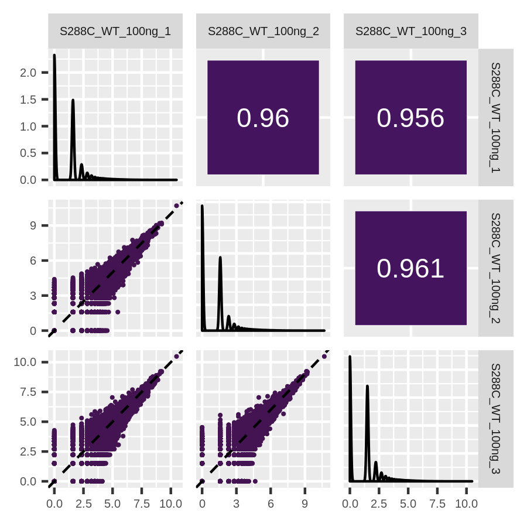

A hierarchically clustered heatmap can also be generated.

```
p <- plot_correlation(exp, data_type = "tss", correlation_plot = "hierarchical", col = viridis::viridis(100))

png("tss_correlation_hierarchical.png", units = "in", res = 300, height = 3.5, width = 4, type = "cairo")
p
dev.off()
```

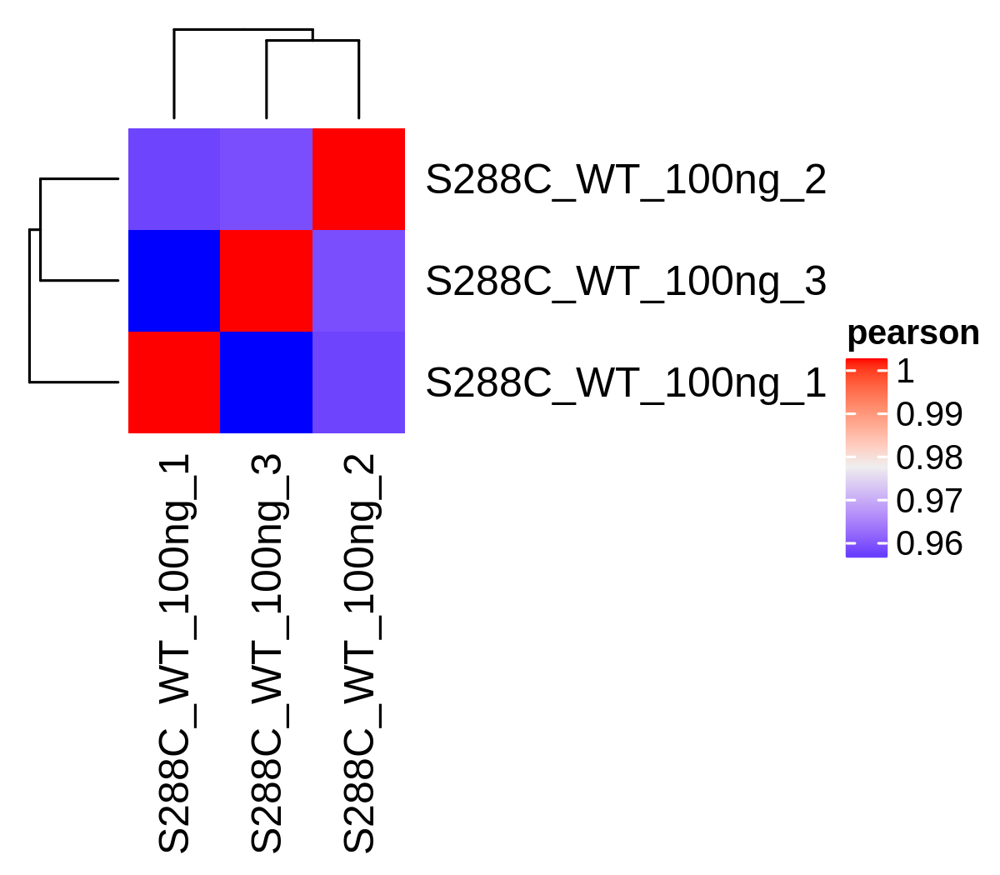

### TSS Annotation and Genomic Distribution

**Annotate TSSs**

```
exp <- annotate_features(exp, annotation_file = annotation, data_type = "tss", feature_type = "transcript")
```

**TSS Genomic Distribution**

```
tss_distribution <- genomic_distribution(exp, data_type = "tss", threshold = 3)

p <- plot_genomic_distribution(tss_distribution) +
	ggplot2::theme(text = element_text(size = 6))

ggsave("tss_genomic_distribution.png", plot = p, device = "png", type = "cairo", height = 1.5, width = 4)
```


It is also possible to plot genomic distribution based on the quantile of the TSS score.

```
genomic_dist <- genomic_distribution(exp, data_type = "tss", threshold = 3, quantiles = 5)

p <- plot_genomic_distribution(genomic_dist) +
	ggplot2::theme(text = element_text(size = 6))

ggsave("tss_genomic_distribution_quantiles.png", plot = p, device = "png", type = "cairo", height = 4, width = 4)
```

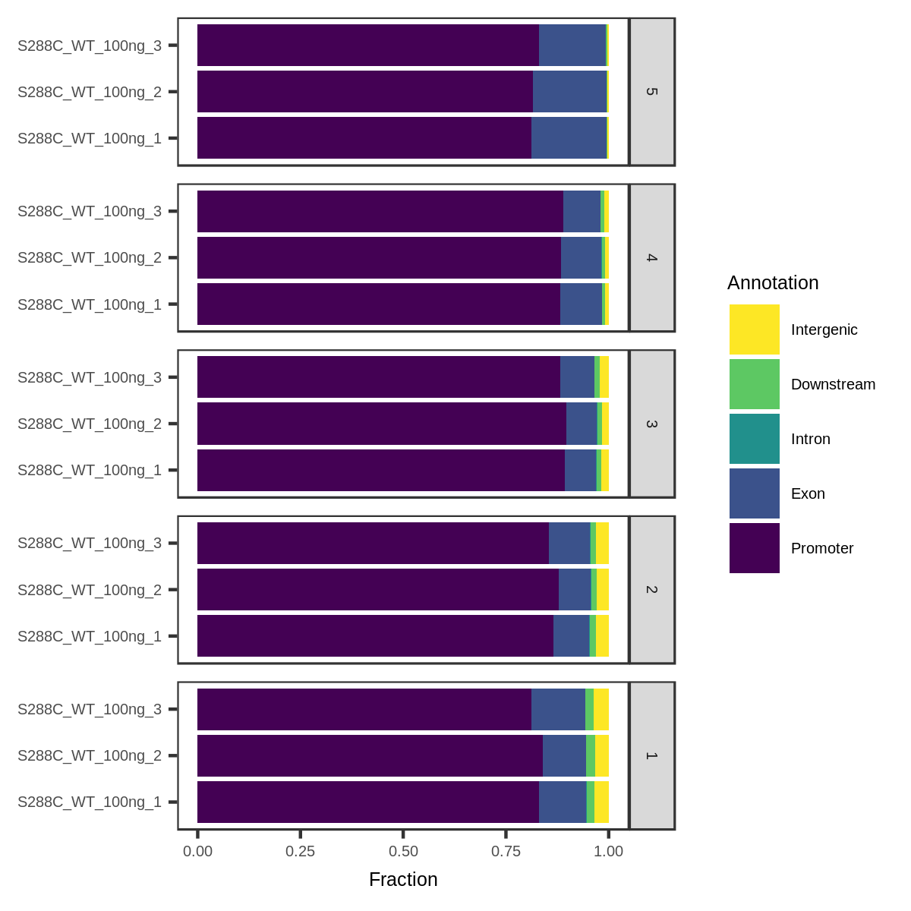

### TSS Feature Detection

```
features <- detect_features(exp, data_type = "tss", feature_type = "transcript", threshold = 3)

p <- plot_detected_features(features, ncol = 3) +
	ggplot2::theme(text = element_text(size = 5))

ggsave("tss_feature_plot.png", plot = p, device = "png", type = "cairo", height = 2, width = 4)
```

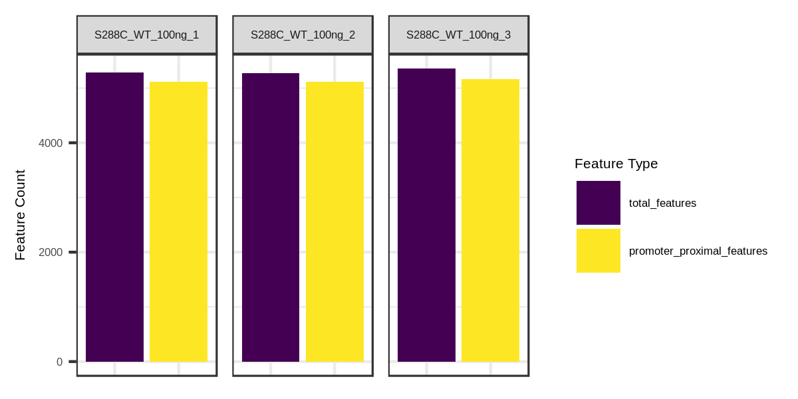

### TSS Average Plot and Heatmap

**TSS average plot**

```
p <- plot_average(exp, data_type = "tss", threshold = 3, ncol = 3) +
	ggplot2::theme(text = element_text(size = 6))

ggsave("tss_average_plot.png", plot = p, device = "png", type = "cairo", height = 1.5, width = 4)
```


You can also plot TSS average plots broken down by TSS quantile

```
p <- plot_average(exp, data_type = "tss", threshold = 3, quantiles = 5) +
	ggplot2::theme(text = element_text(size = 5))

ggsave("tss_average_plot_quantiles.png", plot = p, device = "png", type = "cairo", height = 2.5, width = 3.5)
```

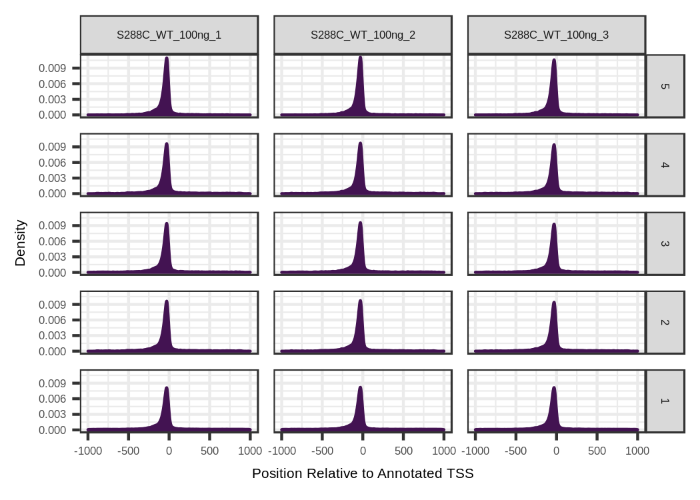

**TSS heatmap**

```
count_matrix <- tss_heatmap_matrix(exp, threshold = 3, anno_type = "geneId", upstream = 250, downstream = 250)

p <- plot_heatmap(count_matrix, ncol = 3) +
	ggplot2::theme(text = element_text(size = 6))

ggsave("tss_heatmap.png", plot = p, device = "png", type = "cairo", height = 2, width = 4)
```


Heatmaps can also be broken down by quantile.

```
count_matrix <- tss_heatmap_matrix(
	exp, threshold = 3, anno_type = "geneId",
	upstream = 250, downstream = 250, quantiles = 5
)

p <- plot_heatmap(count_matrix) +
        ggplot2::theme(text = element_text(size = 6))

ggsave("tss_heatmap_quantiles.png", plot = p, device = "png", type = "cairo", height = 3.5, width = 4)
```

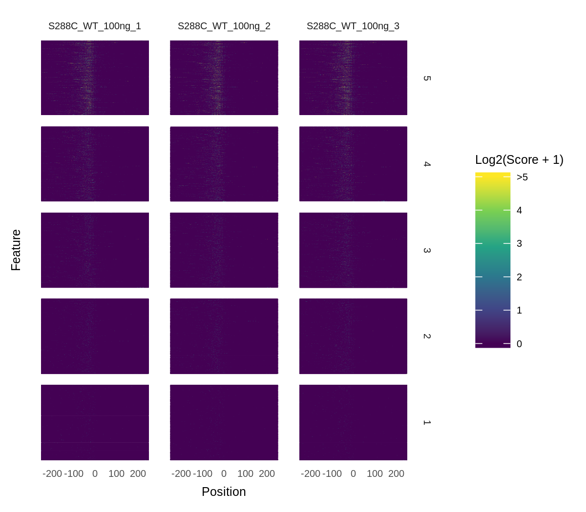

### TSS Motif and Base Composition

**TSS sequence logo**

```
seqs <- tss_sequences(exp, genome_assembly = assembly, threshold = 3)

p <- plot_sequence_logo(seqs, ncol = 3) +

png("tss_seq_logo_quantiles.png", units = "in", res = 300, height = 1, width = 6, type = "cairo")
p
dev.off()

```


The seq logos can also be split by quantile.

```
seqs <- tss_sequences(exp, genome_assembly = assembly, threshold = 3, quantiles = 5)

p <- plot_sequence_logo(seqs, ncol = 3)

png("tss_seq_logo_quantiles.png", units = "in", res = 300, height = 4, width = 6, type = "cairo")
p
dev.off()
```

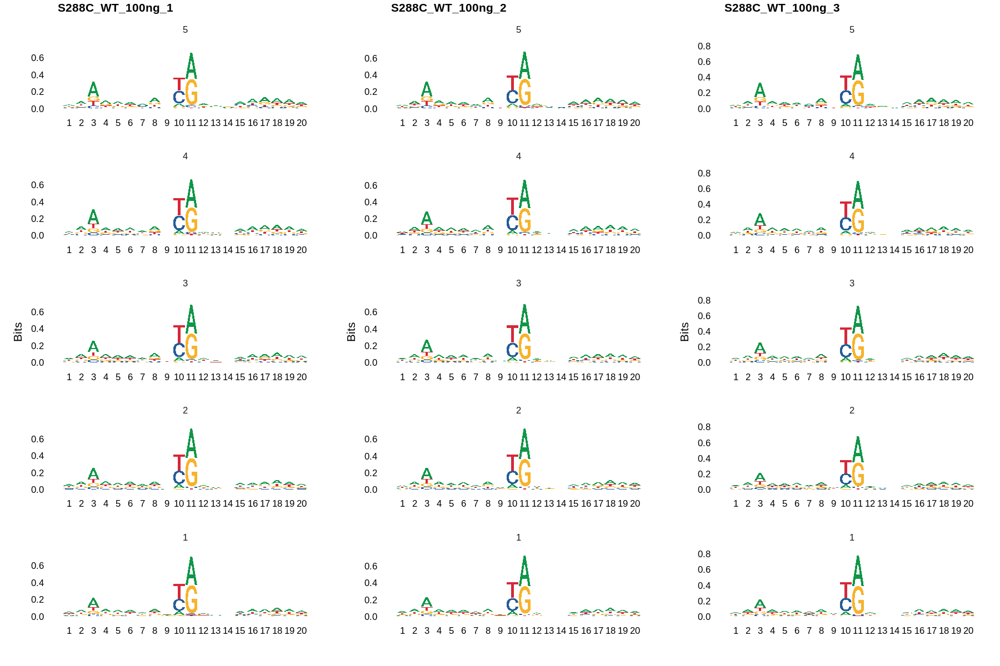

**TSS base color map**

```
seqs <- tss_sequences(exp, genome_assembly = assembly, threshold = 3)

p <- plot_sequence_colormap(seqs, ncol = 3)

png("tss_seq_colormap.png", units = "in", res = 300, height = 2.5, width = 3.5, type = "cairo")
p
dev.off()
```


The color maps can also be split by quantile.

```
seqs <- tss_sequences(exp, genome_assembly = assembly, threshold = 3, quantiles = 5)

p <- plot_sequence_colormap(seqs) +
	ggplot2::theme(text = element_text(size = 5))

ggsave("tss_seq_colormap_quantiles.png", plot = p, device = "png", type = "cairo", height = 6, width = 4)
```

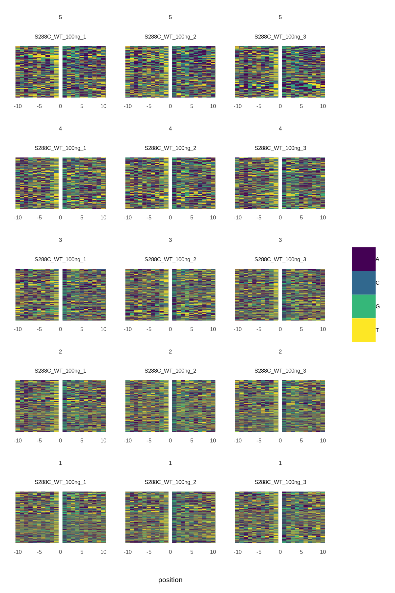

**TSS dinucleotide frequencies**

```
frequencies <- dinucleotide_frequencies(exp, genome_assembly = assembly, threshold = 3)

p <- plot_dinucleotide_frequencies(frequencies, ncol = 3) +
	ggplot2::theme(text = element_text(size = 6))

ggsave("tss_dinucleotide_frequencies.png", plot = p, device = "png", type = "cairo", height = 2, width = 5)
```


You can also plot dinucleotide frequencies by quantile

```
freqs <- dinucleotide_frequencies(exp, assembly, threshold = 3, quantiles = 5)

p <- plot_dinucleotide_frequencies(freqs) +
	ggplot2::theme(text = element_text(size = 5))

ggsave("tss_dinucleotide_frequencies_quantiles.png", plot = p, device = "png", type = "cairo", height = 5, width = 4)
```


### Misc TSS Plots

**Average distance of dominant TSS**

```
dominant <- dominant_tss(exp, threshold = 3, feature_type = "geneId")

p <- plot_dominant_tss(dominant, upstream = 500, downstream = 500, ncol = 3)

ggsave("dominant_tss.png", plot = p, device = "png", type = "cairo", height = 2, width = 6)
```


**Max UTR Length**
``` 
max <- max_utr(exp, threshold = 3, feature_type = "geneId")

p <- plot_max_utr(max, ncol = 3)

ggsave("max_utr.png", plot = p, device = "png", type = "cairo", height = 2, width = 6)
```


## TSR Analysis

### Count Normalization and Correlation

**TMM normalize counts**

```
exp <- count_normalization(exp, data_type = "tsr")
```

**TSR correlation heatmap and scatter plot**

```
p <- plot_correlation(exp, data_type = "tsr") +
	ggplot2::theme_bw() +
	ggplot2::theme(text = element_text(size = 6))

ggsave("tsr_correlation.png", plot = p, device = "png", type = "cairo", height = 3, width = 3)
```


### TSR Metric Plots

**Plot Selected TSR Metric**

The GRanges object with TSRs originally added to the TSR object is allowed to have additional columns.
Information about the TSRs can be contained within these columns, such as TSR width, number of unique TSSs, etc.
You can make a density plot of any of these additional columns by specifying the name of the column containing that metric.

```
p <- plot_tsr_metric(exp, tsr_metrics = c("nTAGs", "nTSSs"), log2_transform = TRUE, ncol = 2) +
	ggplot2::theme(text = element_text(size = 6))

ggsave("tsr_metrics.png", plot = p, device = "png", type = "cairo", width = 4, height = 2)
```
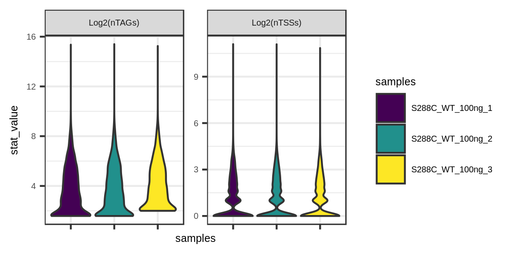

### TSR Annotation and Genomic Distribution

**TSR Annotation**

```
exp <- annotate_features(exp, annotation_file = annotation, data_type = "tsr", feature_type = "transcript")
```

**TSR Genomic Distribution**

```
tsr_distribution <- genomic_distribution(exp, data_type = "tsr")

p <- plot_genomic_distribution(tsr_distribution) +
	ggplot2::theme(text = element_text(size = 6))

ggsave("tsr_genomic_distribution.png", plot = p, device = "png", type = "cairo", height = 1.5, width = 4)
```


TSR genomic distribution can also be split by quantile.

```
tsr_distribution <- genomic_distribution(exp, data_type = "tsr", quantiles = 5)

p <- plot_genomic_distribution(tsr_distribution) +
        ggplot2::theme(text = element_text(size = 6))

ggsave("tsr_genomic_distribution_quantiles.png", plot = p, device = "png", type = "cairo", height = 4, width = 4)
```

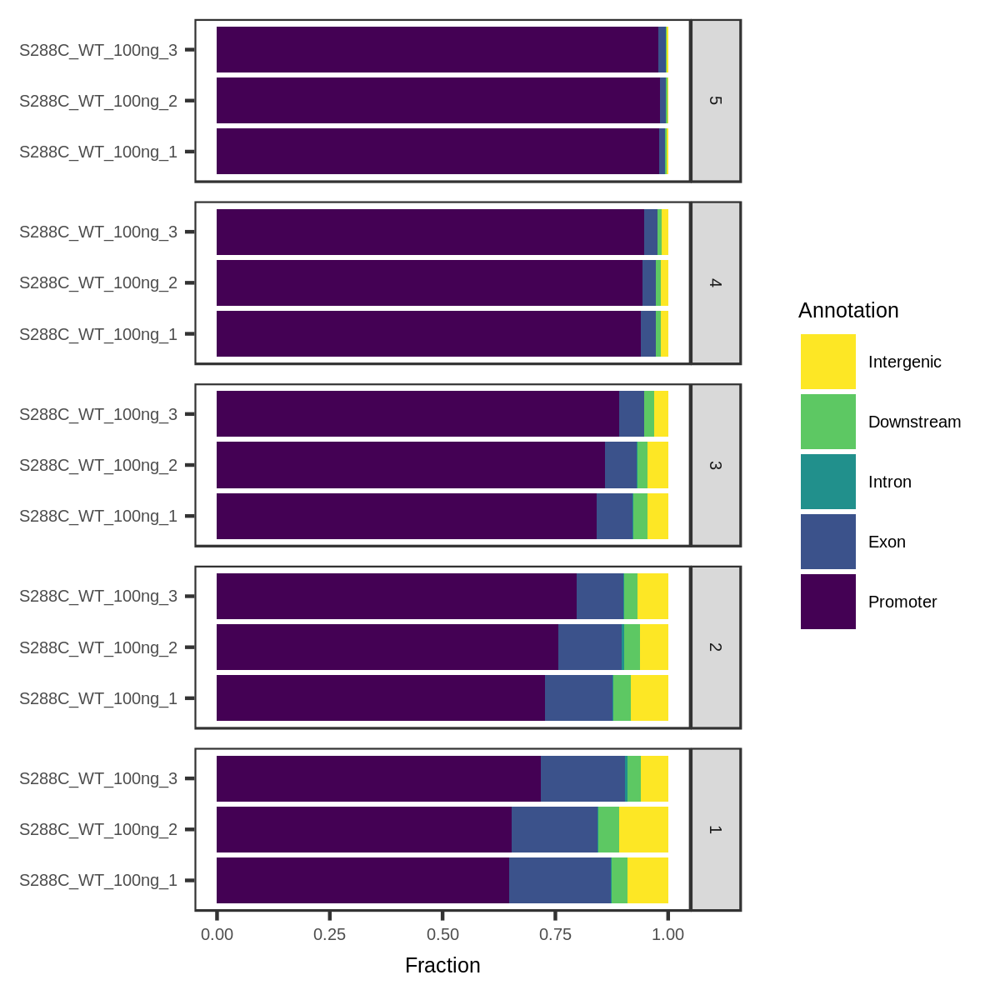

### TSR Feature Detection

```
features <- detect_features(exp, data_type = "tsr", feature_type = "transcript")

p <- plot_detected_features(features, ncol = 3) +
	ggplot2::theme(text = element_text(size = 5))

ggsave("tsr_feature_plot.png", plot = p, device = "png", type = "cairo", height = 2, width = 4)
```

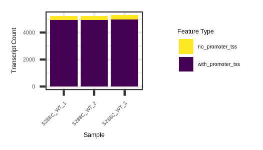

### TSR Average Plot and Heatmap

**TSR Average Plot**

```
p <- plot_average(exp, data_type = "tsr", ncol = 3) +
	ggplot2::theme(text = element_text(size = 6))

ggsave("tsr_average_plot.png", plot = p, device = "png", type = "cairo", height = 1.5, width = 4)
```


Average plots can also be divided up by quantile.

```
p <- plot_average(exp, data_type = "tsr", quantiles = 5) +
	ggplot2::theme(text = element_text(size = 6))

ggsave("tsr_average_plot_quantiles.png", plot = p, device = "png", type = "cairo", height = 2.5, width = 3.5)

```

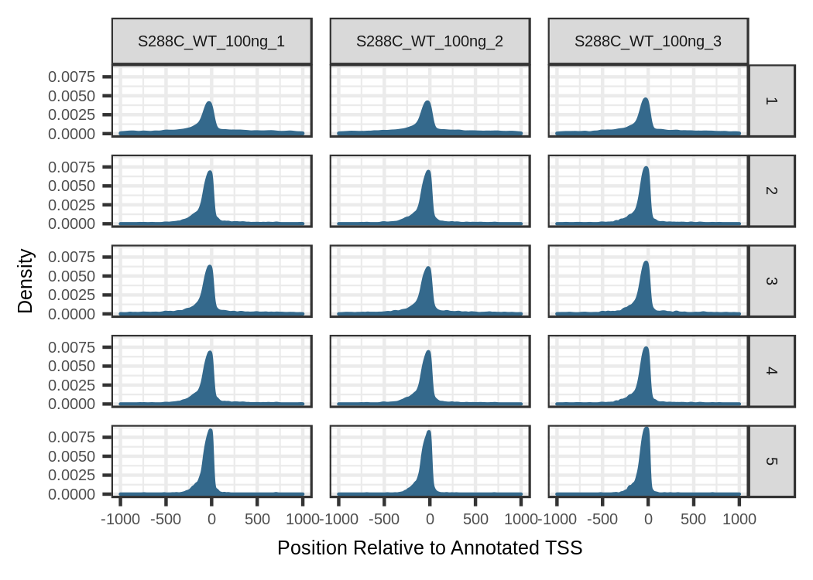

**TSR Heatmap**

```
counts <- tsr_heatmap_matrix(exp, feature_type = "transcriptId", upstream = 500, downstream = 500)

p <- plot_heatmap(counts, max_value = 8, ncol = 3) +
	ggplot2::theme(text = element_text(size = 6))

ggsave("tsr_heatmap.png", plot = p, device = "png", type = "cairo", height = 2, width = 4)
```


The TSR heatmaps can also be broken down into quantiles.

```
counts <- tsr_heatmap_matrix(exp, feature_type = "transcriptId", upstream = 500, downstream = 500, quantiles = 5)

p <- plot_heatmap(counts, max_value = 8) +
        ggplot2::theme(text = element_text(size = 6))

ggsave("tsr_heatmap_quantiles.png", plot = p, device = "png", type = "cairo", height = 3.5, width = 4)
```

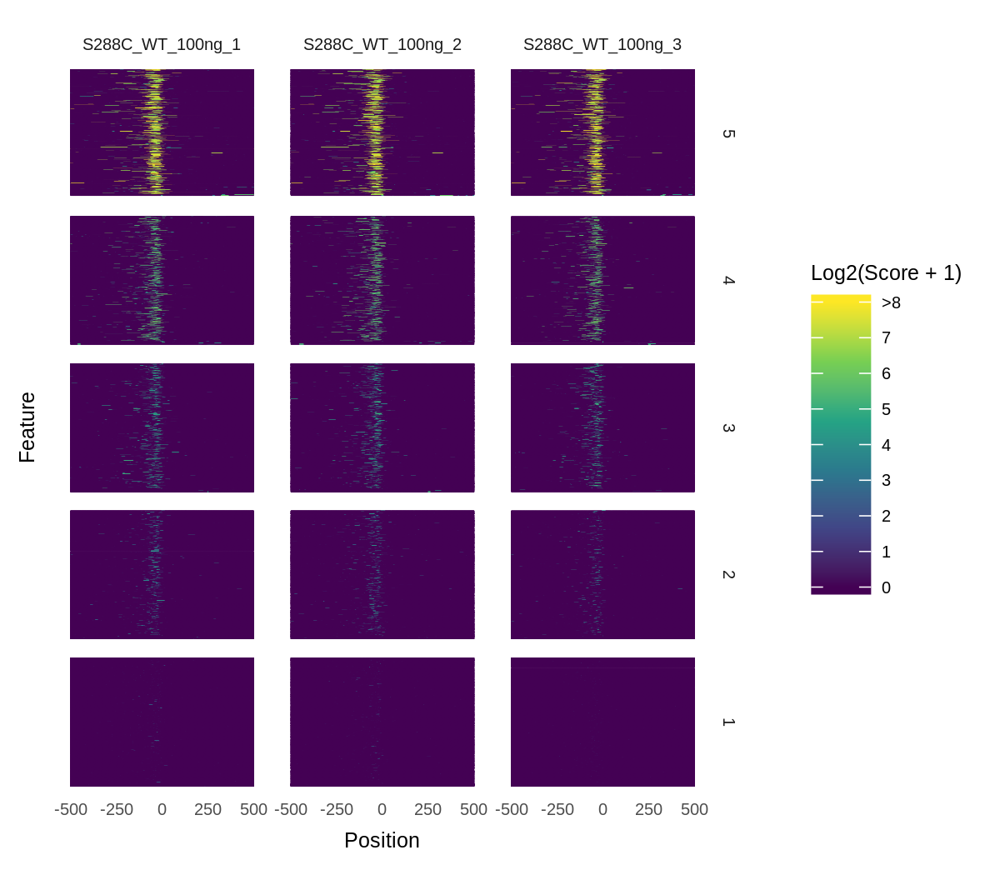

### Differential TSRs

(Work in Progress)

**Find Differential TSRs**

```
edger_model <- fit_edger_model(
	exp,
	data_type = "tsr", 
	samples = c(
		"S288C_WT_100ng_1",
		"S288C_WT_100ng_2",
		"S288C_WT_100ng_3",
		"S288C_Diamide_100ng_1",
		"S288C_Diamide_100ng_2",
		"S288C_Diamide_100ng_3"
	),
	groups = c(1, 1, 1, 2, 2, 2)
)

diff_tsrs <- differential_expression(edger_model, data_type = "tsr", compare_groups = c(1, 2))
```

**Annotate Differential TSRs**

```
annotated_diff_tsrs <- annotate_differential(diff_tsrs, annotation_file = annotation, feature_type = "transcript")
```

**Export data for term enrichment**

```
enrichment_data <- export_for_enrichment(annotated_diff_tsrs)

library("org.Sc.sgd.db")

go_enrichment <- clusterProfiler::compareCluster(
	geneId ~ change,
	data = enrichment_data,
	fun = "enrichGO",
	OrgDb = "org.Sc.sgd.db",
	pAdjustMethod = "fdr"
)
```

**Differential TSRs Volcano Plot**

```
p <- plot_volcano(diff_tsrs)

ggsave("diff_tsrs_volcano_plot.png", plot = p, device = "png", type = "cairo", height = 2, width = 4)
```


## TSS Mapping vs RNA-seq

**Add RNA-seq Data**

```
RNAseq <- system.file("extdata", "yeast_RNAseq.RDS",  package = "tsrexplorer")
RNAseq <- readRDS(RNAseq)

TSSs_total <- system.file("extdata", "yeast_TSSs_total.RDS",  package = "tsrexplorer")
TSSs_total <- readRDS(TSSs_total)

exp <- add_feature_counts(exp, RNAseq, TSSs_total)
exp <- count_normalization(exp, data_type = "features")
```

**RNA-seq Versus TSS Correlation Heatmap and Scatter Plot**

```
p <- plot_correlation(exp, data_type = "features", correlation_metric = "spearman") +
	ggplot2::theme_bw() +
	ggplot2::theme(text = element_text(size = 6))

ggsave("rnaseq_correlation.png", plot = p, device = "png", type = "cairo", height = 4.5, width = 4.5)
```


