# tsrexplorer

## Installing TSRexplorer

**Create conda environment**
```
conda create -n tsrexplorer -y -c conda-forge -c bioconda \
r-tidyverse \
r-devtools \
r-ggseqlogo \
bioconductor-genomicranges \
bioconductor-genomicfeatures \
bioconductor-biostrings \
bioconductor-rsamtools \
bioconductor-chipseeker \
bioconductor-edger
```

**Install latest version of tsrexplorer**
```
devtools::install_github("rpolicastro/tsrexplorer")
```

## Using TSRexplorer

### Preparing TSRexplorer

**Load tsrexplorer**

```
library("tsrexplorer")
```

**Load example data**

```
TSSs <- system.file("extdata", "yeast_TSSs.RDS", package = "tsrexplorer")
TSSs <- readRDS(TSSs)

TSRs <- system.file("extdata", "yeast_TSRs.RDS", package = "tsrexplorer")
TSRs <- readRDS(TSRs)

annotation <- system.file("extdata", "yeast_annotation.gtf", package="tsrexplorer")
assembly <- system.file("extdata", "yeast_assembly.fasta", package="tsrexplorer")
```

**create tsr object**

```
exp <- tsr_explorer(TSSs, TSRs)
```

## TSS Analysis

### Count Normalization and Correlation

**tmm normalize counts**

```
exp <- count_normalization(exp, data_type = "tss")
```

**tss correlation matrix**

```
p <- plot_correlation(exp, data_type = "tss", corr_metric = "pearson")

ggsave("tss_corr.png", plot = p, device = "png", type = "cairo", height = 3.5, width = 5)
```


**generate tss scatter plots**

```
p <- plot_scatter(exp, sample_1 = "S288C_WT_100ng_1", sample_2 = "S288C_WT_100ng_2", data_type = "tss")

ggsave("tss_scatter.png", plot = p, device = "png", type = "cairo", height = 4, width = 4)
```


### TSS Annotation and Genomic Distribution

**Annotate TSSs**

```
exp <- annotate_features(exp, annotation_file = annotation, data_type = "tss", feature_type = "transcript")
```

**TSS Genomic Distribution**

```
tss_distribution <- genomic_distribution(exp, sample = "S288C_WT_100ng_1", data_type = "tss", threshold = 3)

p <- plot_genomic_distribution(tss_distribution)

ggsave("tss_genomic_distribution.png", plot = p, device = "png", type = "cairo", height = 2, width = 5)
```

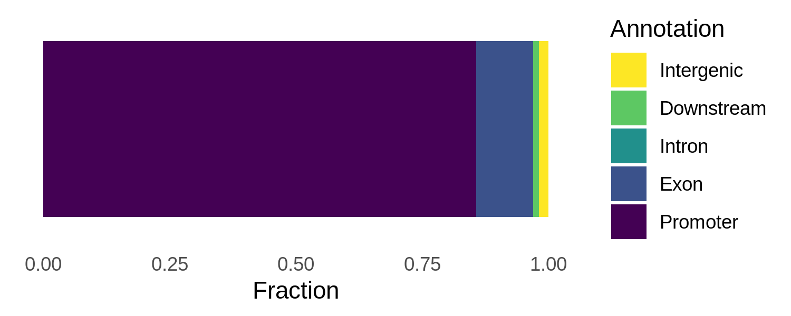

### TSS Average Plot and Heatmap

**TSS average plot**

```
p <- plot_average(exp, sample = "S288C_WT_100ng_1", data_type = "tss", threshold = 3)

ggsave("tss_average_plot.png", plot = p, device = "png", type = "cairo", height = 4, width = 4)
```


**TSS heatmap**

```
count_matrix <- tss_heatmap_matrix(exp, sample = "S288C_WT_100ng_1", threshold = 3, anno_type = "geneId")

p <- plot_tss_heatmap(count_matrix)

ggsave("tss_heatmap.png", plot = p, device = "png", type = "cairo", height = 4, width = 3)
```


### TSS Motif and Base Composition

**TSS sequence logo**

```
seqs <- tss_sequences(exp, sample = "S288C_WT_100ng_1", genome_assembly = assembly, threshold = 3)

p <- plot_sequence_logo(seqs)

ggsave("tss_seq_logo.png", plot = p, device = "png", type = "cairo", height = 1.5, width = 4)

```


**TSS base color map**

```
p <- plot_sequence_colormap(seqs)

ggsave("tss_seq_colormap.png", plot = p, device = "png", type = "cairo", height = 4, width = 4)
```


**TSS dinucleotide frequencies**

```
frequencies <- dinucleotide_frequencies(exp, sample = "S288C_WT_100ng_1", genome_assembly = assembly, threshold = 3)

p <- plot_dinucleotide_frequencies(frequencies)

ggsave("tss_dinucleotide_frequencies.png", plot = p, device = "png", type = "cairo", height = 3, width = 4)
```


### Misc TSS Plots

**Average distance of dominant TSS**

```
dominant <- dominant_tss(exp, sample = "S288C_WT_100ng_1", threshold = 3, feature_type = "geneId")

p <- plot_dominant_tss(dominant, upstream = 500, downstream = 500)

ggsave("dominant_tss.png", plot = p, device = "png", type = "cairo", height = 4, width = 4)
```

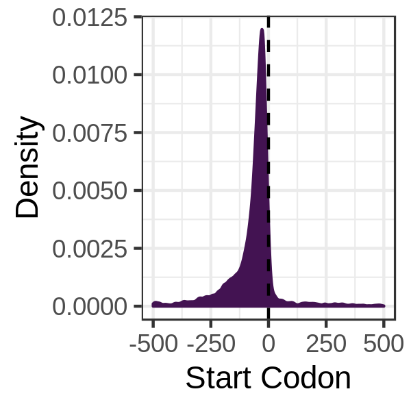

**Max UTR Length**
``` 
max <- max_utr(exp, sample = "S288C_WT_100ng_1", threshold = 3, feature_type = "geneId")

p <- plot_max_utr(max)

ggsave("max_utr.png", plot = p, device = "png", type = "cairo", height = 4, width = 4)
```

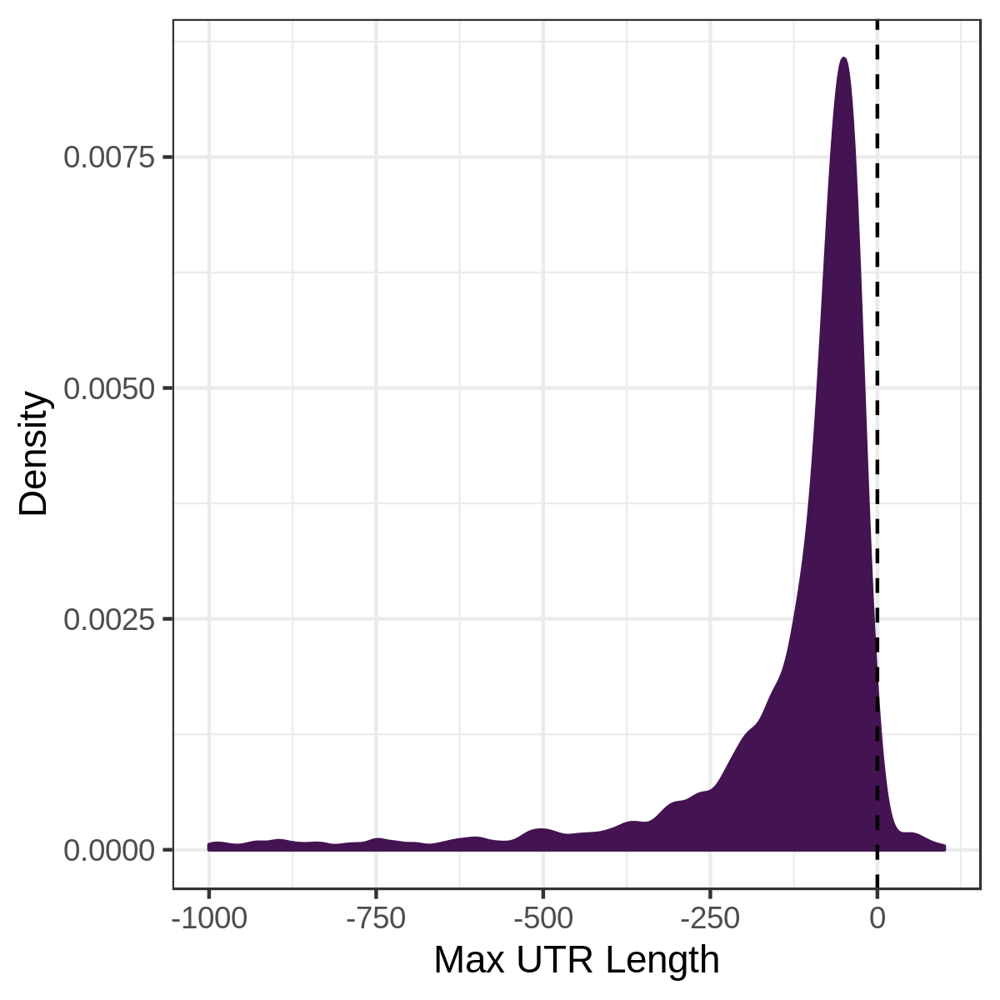

## TSR Analysis

### Count Normalization and Correlation

**TMM normalize counts**

```
exp <- count_normalization(exp, data_type = "tsr")
```

**TSR correlation matrix**

```
p <- plot_correlation(experiment, data_type = "tsr", corr_metric = "pearson")

ggsave("tsr_corr.png", plot = p, device = "png", type = "cairo", height = 3.5, width = 5)
```

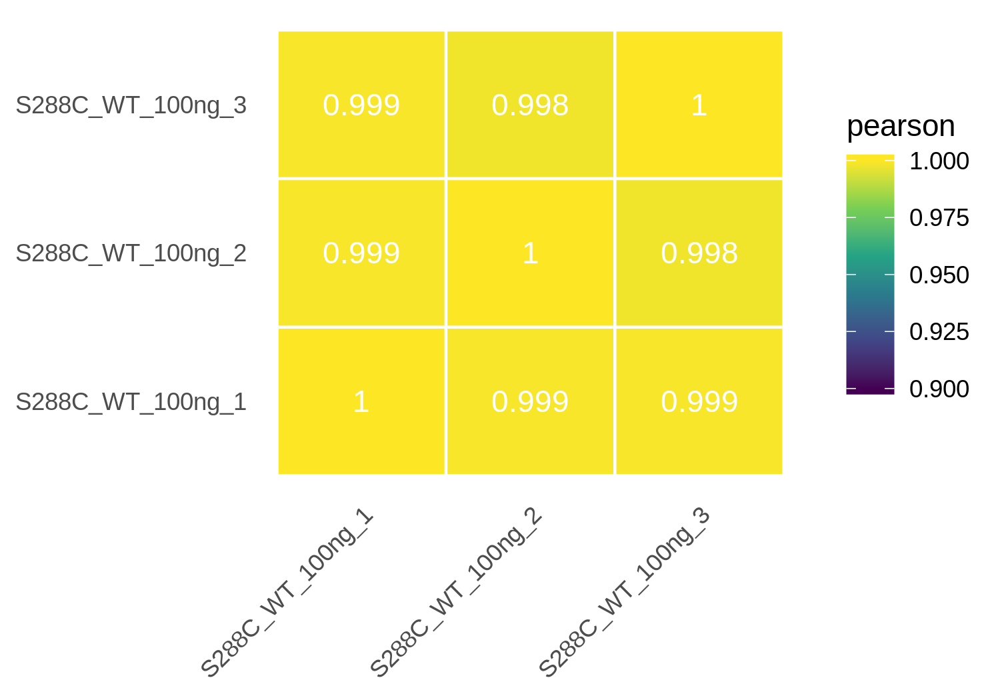

**TSR scatter plot**

```
p <- plot_scatter(exp, sample_1 = "S288C_WT_100ng_1", sample_2 = "S288C_WT_100ng_2", data_type = "tsr")

ggsave("tsr_scatter.png", plot = p, device = "png", type = "cairo", height = 4, width = 4)
```

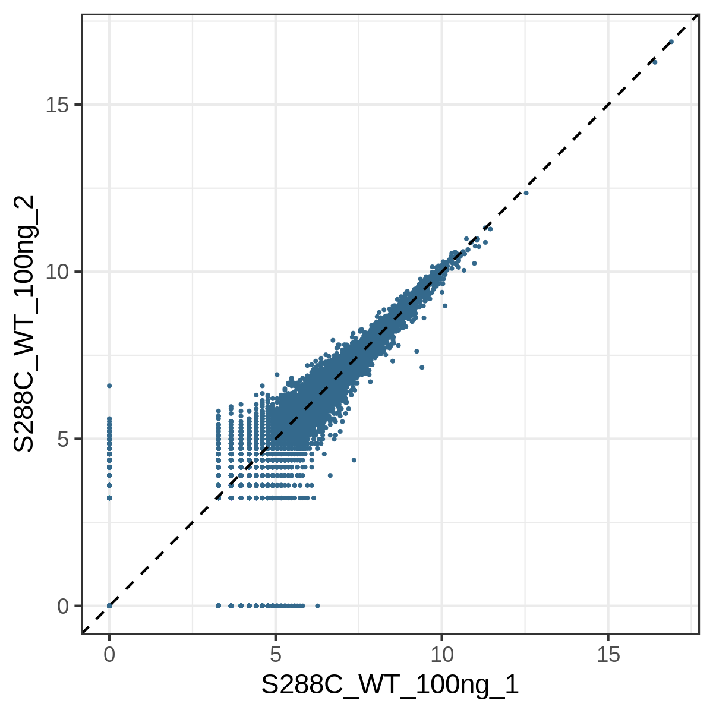

### TSR Metric Plots

**Plot Selected TSR Metric**

The GRanges object with TSRs originally added to the TSR object is allowed to have additional columns.
Information about the TSRs can be contained within these columns, such as TSR width, number of unique TSSs, etc.
You can make a density plot of any of these additional columns by specifying the name of the column containing that metric.

```
# Example plots uses the 'nTAGs' column, which is just the total number of reads in the TSR.
p <- plot_tsr_metric(exp, sample = "S288C_WT_100ng_1", metric = "nTAGs", log2_transform = TRUE, xlims = c(0,10))

ggsave("tsr_strength.png", plot = p, device = "png", type = "cairo", width = 4, height = 4)
```
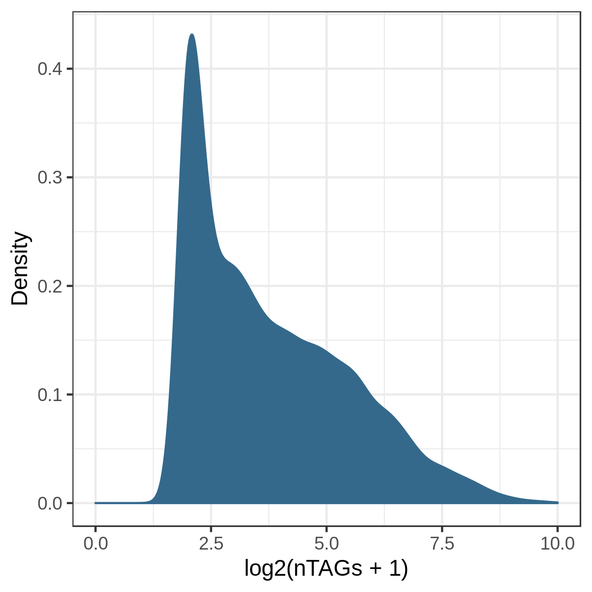

### TSR Annotation and Genomic Distribution

**TSR Annotation**

```
exp <- annotate_features(exp, annotation_file = annotation, data_type = "tsr", feature_type = "transcript")
```

**TSR Genomic Distribution**

```
tsr_distribution <- genomic_distribution(exp, sample = "S288C_WT_100ng_1", data_type = "tsr")

p <- plot_genomic_distribution(tsr_distribution)

ggsave("tsr_genomic_distribution.png", plot = p, device = "png", type = "cairo", height = 2, width = 5)
```

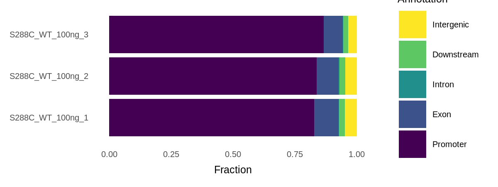

### TSR Average Plot and Heatmap

**TSR Average Plot**

```
p <- plot_average(exp, sample = "S288C_WT_100ng_1", data_type = "tsr")

ggsave("tsr_average_plot.png", plot = p, device = "png", type = "cairo", height = 4, width = 4)
```

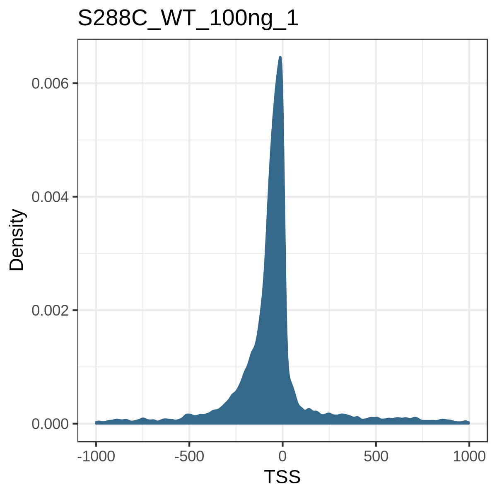

**TSR Heatmap**

```
counts <- tsr_heatmap_matrix(exp, sample = "S288C_WT_100ng_1", feature_type = "transcriptId")

p <- plot_tsr_heatmap(counts)

ggsave("tsr_heatmap.png", plot = p, device = "png", type = "cairo", height = 4, width = 3)
```

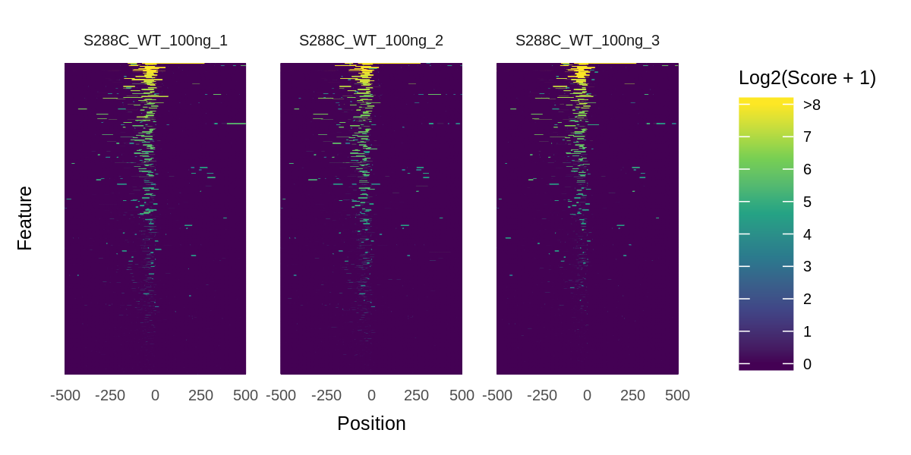

### Differential TSRs

(Work in Progress)

**Find Differential TSRs**

```
edger_model <- fit_edger_model(
	exp,
	data_type = "tsr", 
	samples = c(
		"S288C_WT_100ng_1",
		"S288C_WT_100ng_2",
		"S288C_WT_100ng_3",
		"S288C_Diamide_100ng_1",
		"S288C_Diamide_100ng_2",
		"S288C_Diamide_100ng_3"
	),
	groups = c(1, 1, 1, 2, 2, 2)
)

diff_tsrs <- differential_expression(edger_model, data_type = "tsr", comparisons = c(1, 2))
```

**Annotate Differential TSRs**

```
annotated_diff_tsrs <- annotate_differential_tsrs(diff_tsrs, annotation_file = annotation, feature_type = "transcript")
```

**Differential TSRs Volcano Plot**

```
p <- plot_volcano(diff_tsrs)

ggsave("diff_tsrs_volcano_plot.png", plot = p, device = "png", type = "cairo", height = 2, width = 4)
```

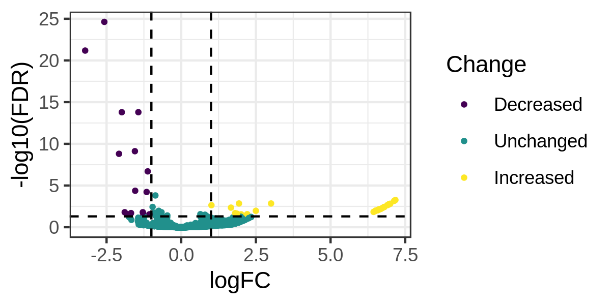

## TSS Mapping vs RNA-seq

**Add RNA-seq Data**

```
RNAseq <- system.file("extdata", "yeast_RNAseq.RDS",  package = "tsrexplorer")
RNAseq <- readRDS(RNAseq)

TSSs_total <- system.file("extdata", "yeast_TSSs_total.RDS",  package = "tsrexplorer")
TSSs_total <- readRDS(TSSs_total)

exp <- add_rnaseq_feature_counts(exp, RNAseq)
exp <- count_normalization(exp, data_type = "rnaseq_features")

exp <- add_tss_feature_counts(exp, TSSs_total)
exp <- count_normalization(exp, data_type = "tss_features")
```

**RNA-seq Versus TSS Correlation Heatmap**

```
p <- plot_correlation(exp, data_type = "rnaseq_v_tss", corr_metric = "spearman")

ggsave("rnaseq_correlation.png", plot = p, device = "png", type = "cairo", height = 3.5, width = 5)
```

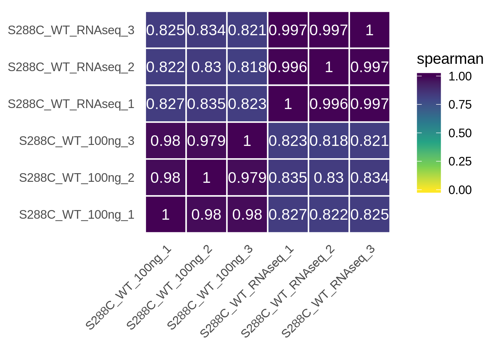

**RNA-seq Versus TSS Scatter Plot**

```
p <- plot_scatter(exp, sample_1 = "S288C_WT_RNAseq_1", sample_2 = "S288C_WT_100ng_1", data_type = "rnaseq_v_tss")

ggsave("rnaseq_scatter.png", plot = p, device = "png", type = "cairo", height = 4, width = 4)
```

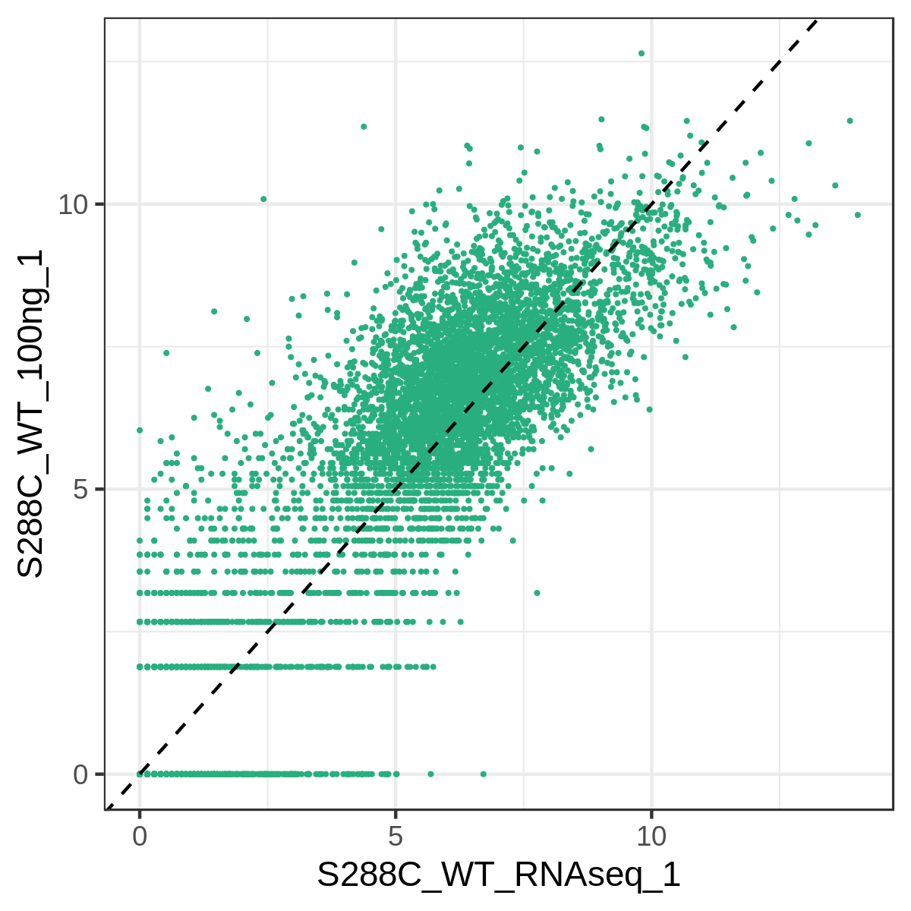
