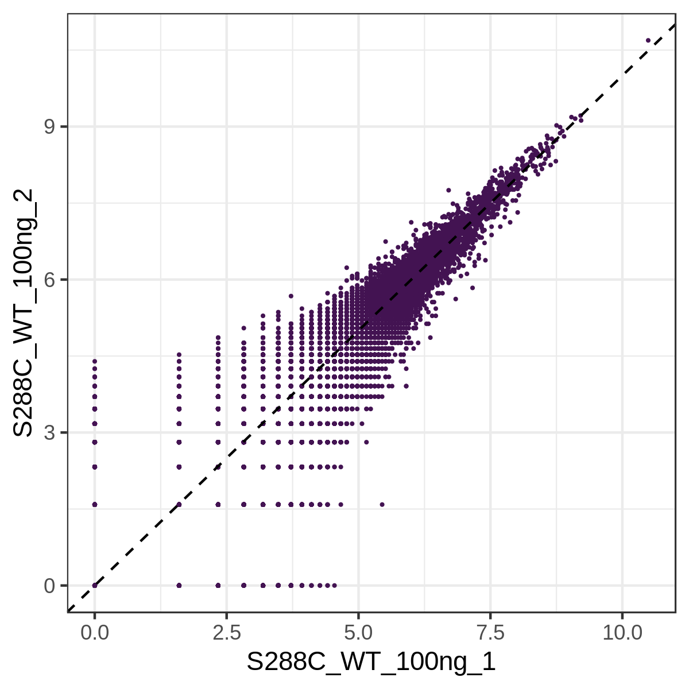
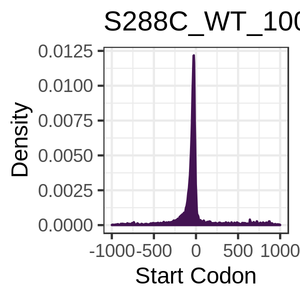
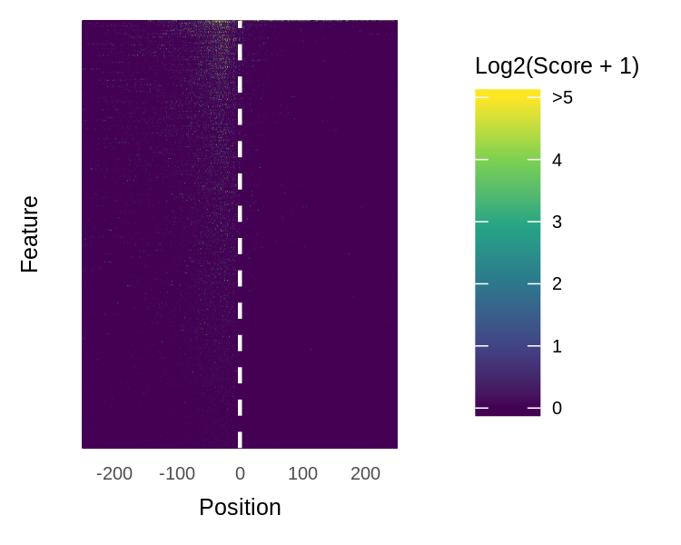
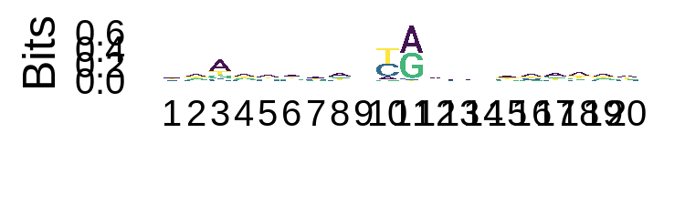
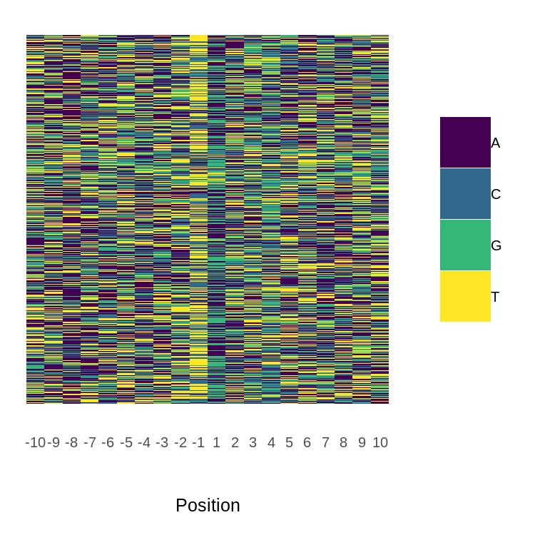
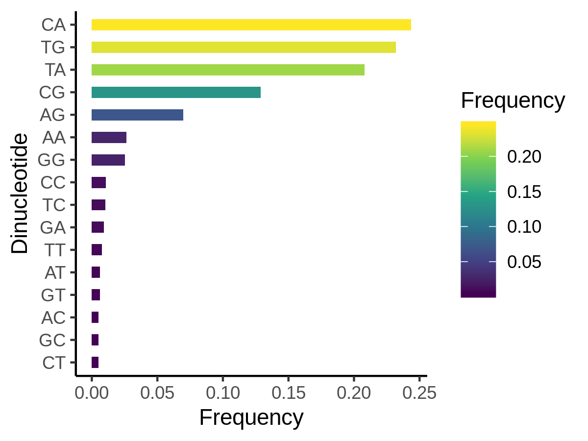

# tsrexplorer

## Installing TSRexplorer

```
devtools::install_github("rpolicastro/tsrexplorer")
```

## Using TSRexplorer

### Preparing TSRexplorer

**Load tsrexplorer**

```
library("tsrexplorer")
```

**Load example data**

```
TSSs <- system.file("extdata", "yeast_TSSs.RDS", package="tsrexplorer")
TSSs <- readRDS(TSSs)

annotation <- system.file("extdata", "yeast_annotation.gtf", package="tsrexplorer")
assembly <- system.file("extdata", "yeast_assembly.fasta", package="tsrexplorer")
```

**create tsr object**

```
exp <- tsr_explorer(TSSs)
```

### Count Normalization and Correlation

**tmm normalize counts**

```
exp <- tss_normalization(exp)
```

**tss correlation matrix**

```
p <- plot_tss_corr(exp, corr_metric="pearson")

ggsave("tss_corr.png", plot = p, device = "png", type = "cairo", height = 2.5, width = 4)
```


**generate tss scatter plots**

```
p <- plot_tss_scatter(exp, sample_1 = "S288C_WT_100ng_1", sample_2 = "S288C_WT_100ng_2")

ggsave("tss_scatter.png", plot = p, device = "png", type = "cairo", height = 2, width = 2)
```


### TSS Annotation

```
exp <- tss_annotation(exp, gtf = annotation)
```

### TSS Average Plot and Heatmap

**TSS average plot**

```
p <- plot_tss_average(exp, sample = "S288C_WT_100ng_1", threshold = 3)

ggsave("tss_average_plot.png", plot = p, device = "png", type = "cairo", height = 2, width = 2)
```



**TSS heatmap**

```
count_matrix <- tss_count_matrix(exp, sample = "S288C_WT_100ng_1", threshold = 3, anno_type = "geneId")

p <- plot_tss_heatmap(count_matrix)

ggsave("tss_heatmap.png", plot = p, device = "png", type = "cairo", height = 2, width = 2)
```



### TSS Motif and Base Composition

**TSS sequence logo**

```
seqs <- tss_sequences(exp, sample = "S288C_WT_100ng_1", genome_assembly = assembly, threshold = 3)

p <- plot_sequence_logo(seqs)

ggsave("tss_seq_logo.png", plot = p, device = "png", type = "cairo", height = 1, width = 3)

```



**TSS base color map**

```
p <- plot_sequence_colormap(seqs)

ggsave("tss_seq_colormap.png", plot = p, device = "png", type = "cairo", height = 2, width = 2)
```


**TSS dinucleotide frequencies**

```
frequencies <- dinucleotide_frequencies(exp, sample = "S288C_WT_100ng_1", genome_assembly = assembly, threshold = 3)

p <- plot_dinucleotide_frequencies(frequencies)

ggsave("tss_dinucleotide_frequencies.png", plot = p, device = "png", type = "cairo", height = 2, width = 2.5)
```

 
