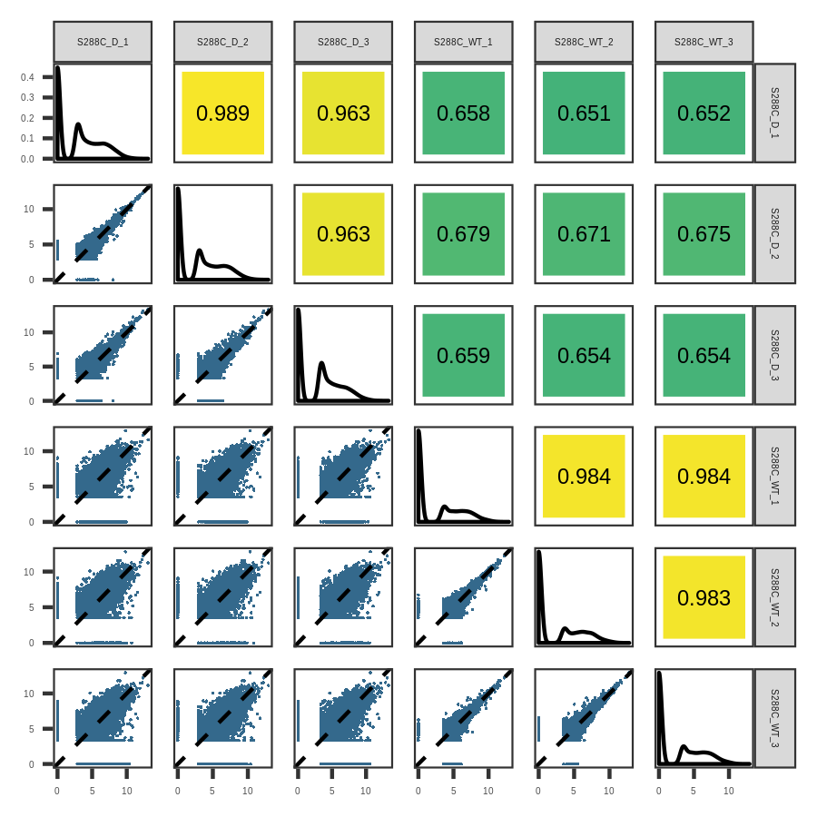
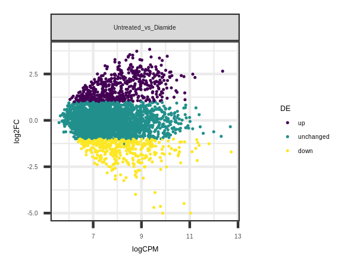
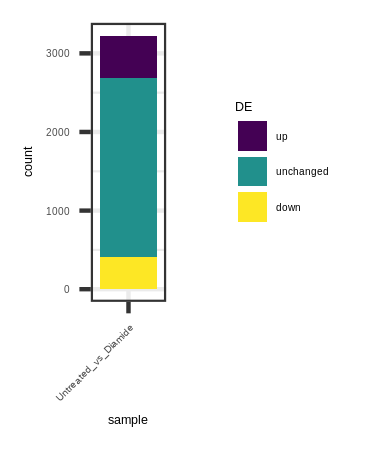
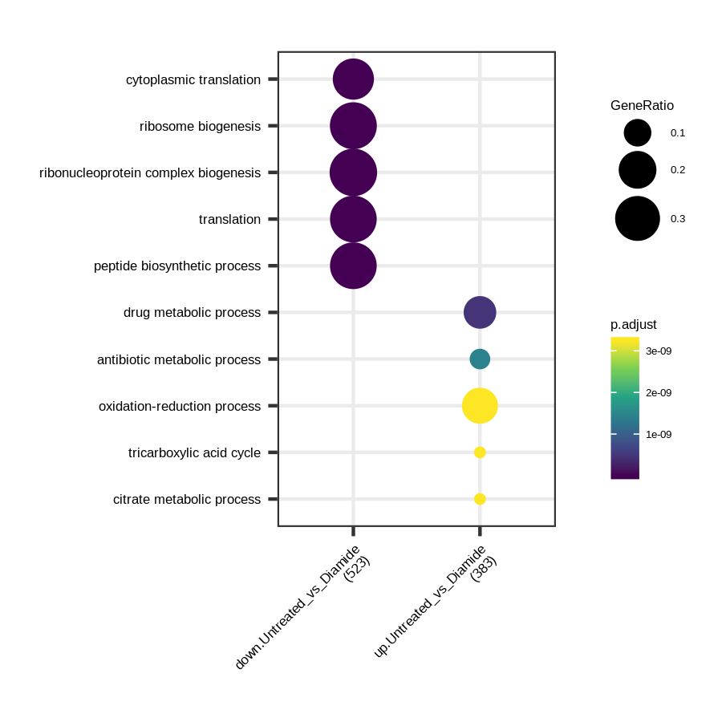
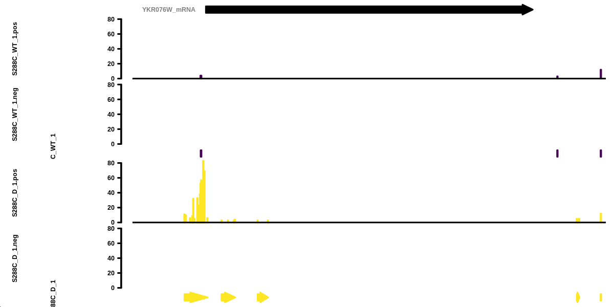

# Differential Features

It has been previously shown that there are pervasive changes in TSSs and TSRs between
different developmental conditions, disease states, and in response to the environment.
These changes in TSRs may be a functionally important readout for alternative promoter useage,
as well as other factors such as transcript isoform.

tsrexplorer allows the discovery of differential TSSs, TSRs, and feature level counts similar to RNA-seq.

## Preparing Data

This example will use a set of *S. cerevisiae* TSRs collected using the STRIPE-seq method.
One of the TSR sets comes from a treatment group that consisted of
a 1 hour exposure to 1.5 mM Diamide prior to collection of total-RNA.
Diamide is a reducing agent that damages DNA, and was shown to cause large changes to the transcriptome.

```
library("tsrexplorer")
library("magrittr")

TSSs <- system.file("extdata", "S288C_TSSs.RDS", package = "tsrexplorer")
TSSs <- readRDS(TSSs)

exp <- tsr_explorer(TSSs)
```
Adding a sample sheet allows for easier processing downstream.

```
sample_sheet <- data.table(
	replicate_id = c(rep("Diamide", 3), rep("Untreated", 3)),
	tss_name = c(sprintf("S288C_D_%s", seq_len(3)), sprintf("S288C_WT_%s", seq_len(3))),
	tsr_name = c(sprintf("S288C_D_%s", seq_len(3)), sprintf("S288C_WT_%s", seq_len(3)))
)

exp <- add_sample_sheet(exp, sample_sheet)
```

## Processing of TSSs

The start of TSS processing is similar to that shown in the standard analysis vignette.
Details about each step can be found [here](./TSR_ANALYSIS.md#processing-of-tsrs).
A few of the steps are skipped for expediencey of the vignette,
but all analysis and plots can be generated for the different treatment condition sets.

```
exp <- format_counts(exp, data_type = "tss") %>%
	tss_clustering(threshold = 3, max_distance = 25) %>%
	associate_with_tsr
```

## TSR Correlation and Dimension Reduction

Correlation analysis and dimensionality reduction is a good first step to assess overall differences between samples.

### TMM Normalization

Just as with the normal TSS and TSR analysis, 'TMM' normalization is used for more faithful comparison *between* samples.
These values will be used for both the correlation and dimensionality reduction plots.

```
exp <- count_matrix(exp, data_type = "tsr")
exp <- tmm_normalize(exp, data_type = "tsr")
```

### Correlation Matrix Plots

After 'TMM' normalizing between the samples, various correlation plots can be generated by tsrexplorer.
An example is shown here, in which half the plot is a scatter plot, and the other half a heatmap.
Already one can start to see a difference between the untreated and treated samples.

```
p <- plot_correlation(exp, data_type = "tsr", font_size = 2, pt_size = 0.4) +
        ggplot2::theme_bw() +
        ggplot2::theme(text = element_text(size = 3), panel.grid = element_blank())

ggsave("diff_tsr_correlation.png", plot = p, device = "png", type = "cairo", height = 3, width = 3)
```



### Dimensionality Reduction

Another useful way to check differences between samples (and look at replicate concordance)
is to generate a dimensionality reduction plot.
The preferred plot type for this is UMAP for its general robustness, stability, and often better ability to separate points.

```
p <- plot_reduction(exp, data_type = "tsr", size = 0.5) +
	ggplot2::theme(text = element_text(size = 3), legend.key.size = unit(0.2, "cm"))

ggsave("diff_tsr_reduction.png", plot = p, device = "png", type = "cairo", height = 1.25, width = 2)
```


## Differential TSRs

Between different developmental or environmental conditions, there may be differential useage of TSSs and TSRs.
tsrexplorer takes advantage of edgeR to allow the discovery of these potential differential features.

### Discovering Differential TSRs

The first step is to build an edgeR model that contains the samples and their (replicate) groups.
This can be done at the TSS, TSR, or feature level. This example will be looking at differential TSRs.

```
exp <- fit_edger_model(
	exp, data_type = "tsr",
	samples = c(
		"S288C_WT_1", "S288C_WT_2", "S288C_WT_3",
		"S288C_D_1", "S288C_D_2", "S288C_D_3"
	),
	groups = c(rep("Untreated", 3), rep("Diamide", 3))
)
```

After building the edgeR model, the model can then be used to call differential TSRs.

```
exp <- differential_expression(exp, data_type = "tsr", compare_groups = c("Untreated", "Diamide"))
```

### MA Plots

MA plots provide a good overview of the distribution of differentially expressed genes relative to average gene expression.

```
p <- plot_ma(exp, data_type = "tsr", de_comparisons = "Untreated_vs_Diamide", size = 0.25, stroke = 0.25) +
	ggplot2::theme(text = element_text(size = 3), legend.key.size = unit(0.2, "cm"))

ggsave("diff_tsr_ma.png", plot = p, device = "png", type = "cairo", height = 1.5, width = 2)
```


### Number of DE TSRs

A convenient plot to visualize the number of DE TSRs between the different comparisons.

```
p <- plot_num_de(exp, data_type = "tsr", de_comparisons = "Untreated_vs_Diamide") +
	ggplot2::theme(text = element_text(size = 3), legend.key.size = unit(0.3, "cm"))

ggsave("tsr_num_de.png", plot = p, device = "png", type = "cairo", height = 1.5, width = 1.25)
```


## Gene Ontology.

Gene ontology enrichment is a good way to uncover the higher order processes that are being changed.
The preferred tool for enrichment analysis in R is the clusterProfiler library.
tsrexplorer provides a convenient function to export DE features to a format ready for analysis with clusterProfiler.

```
enrichment_data <- export_for_enrichment(experiment, data_type = "tsr", de_comparisons = "Untreated_vs_Diamide")

library("clusterProfiler")
library("org.Sc.sgd.db")

go_enrichment <- compareCluster(
	geneId ~ sample + DE,
	data = enrichment_data,
	fun = "enrichGO",
	OrgDb = "org.Sc.sgd.db",
	pAdjustMethod = "fdr",
	ont = "BP",
	keyType = "ENSEMBL"
)

p <- dotplot(go_enrichment, font.size = 4) +
	scale_color_viridis_c() +
	theme(
		text = element_text(size = 4),
		axis.text.x = element_text(angle = 45, hjust = 1),
		legend.key.size = unit(0.3, "cm")
	)

ggsave("tsr_enrichment.png", plot = p, device = "png", type = "cairo", height = 3, width = 3)

```


## Gene Tracks.

First, prepare the TSSs so they can be included in the plot.

```
exp <- format_counts(exp, data_type = "tss")
```
You can now make the gene track for an example gene that had a differential TSR.

```
annotation <- system.file("extdata", "S288C_Annotation.gtf", package = "tsrexplorer")

png("diff_tsr_tracks.png", units = "in", res = 300, height = 2, width = 4, type = "cairo")
gene_tracks(
        experiment, annotation, feature_name = "YKR076W", threshold = 3, axis_scale = 0.25,
        samples = c("TSS:S288C_WT_1", "TSR:S288C_WT_1", "TSS:S288C_D_1", "TSR:S288C_D_1"),
        ymax = 80, tss_colors = viridis::viridis(2), tsr_colors = viridis::viridis(2)
)
dev.off()
```

