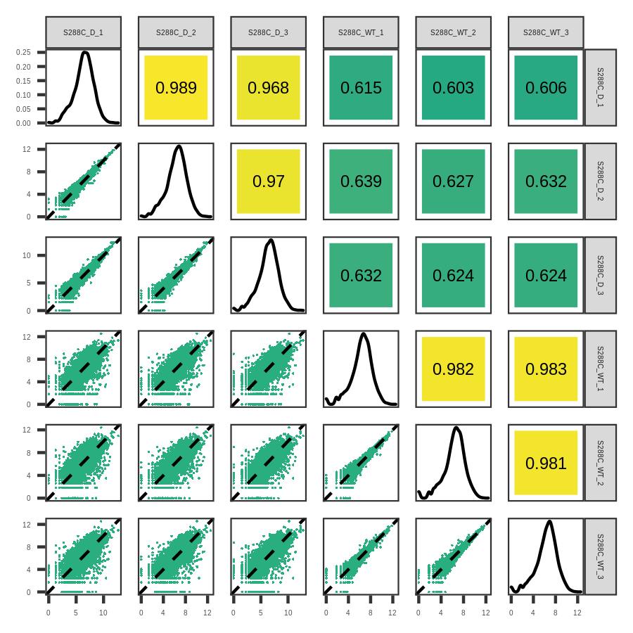
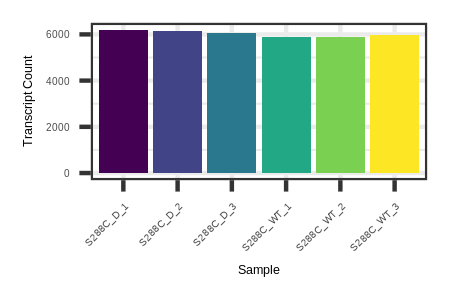
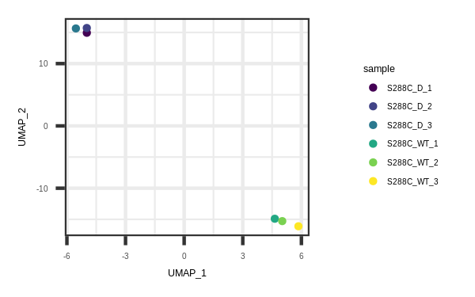
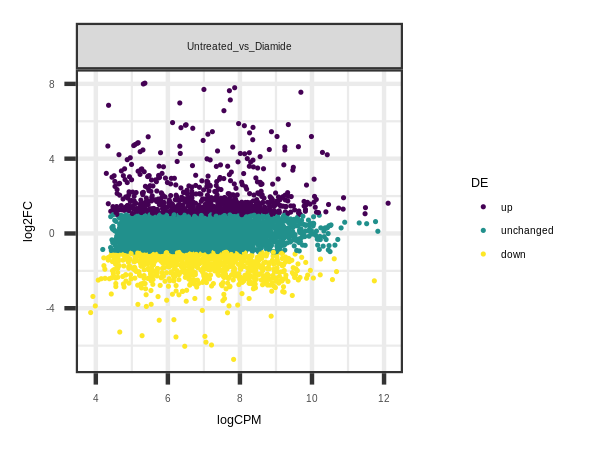
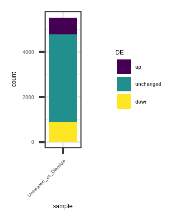
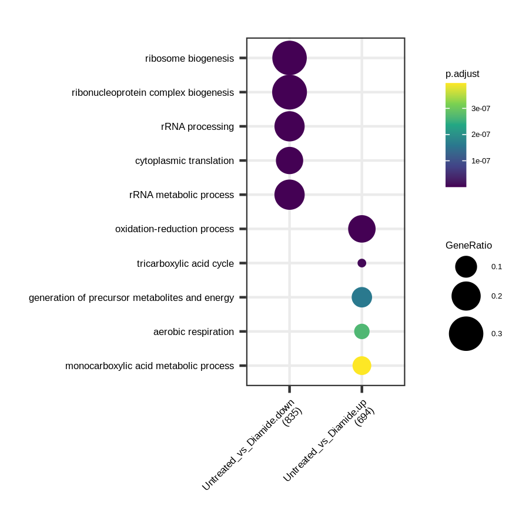

# RNA-seq Like Analaysis

Prepare the TSSs for feature counting.

```
library("tsrexplorer")
library("magrittr")

TSSs <- system.file("extdata", "S288C_TSSs.RDS", package = "tsrexplorer")
TSSs <- readRDS(TSSs)

exp <- tsr_explorer(TSSs)
exp <- format_counts(exp, data_type = "tss")
```

Annotate the TSSs to the nearest transcript.

```
annotation <- system.file("extdata", "S288C_Annotation.gtf", package = "tsrexplorer")
exp <- annotate_features(
        exp, annotation_data = annotation,
        data_type = "tss", feature_type = "gene"
)
```

Summarize the reads per gene.

```
exp <- count_features(exp, "tss")
```

TMM normalize for correlation.

```
exp <- count_matrix(exp, "tss_features")
exp <- tmm_normalize(exp, "tss_features", threshold = 3, n_samples = 3)
```

Correlation matrix plot.

```
p <- plot_correlation(exp, data_type = "tss_features", font_size = 2, pt_size = 0.4) +
        ggplot2::theme_bw() +
        ggplot2::theme(text = element_text(size = 3), panel.grid = element_blank())

ggsave("tss_feature_correlation.png", plot = p, device = "png", type = "cairo", height = 3, width = 3)
```



Get number of detected features.

```
features <- detect_features(exp, data_type = "tss_features", threshold = 3)

p <- plot_detected_features(features) +
        ggplot2::theme(text = element_text(size = 3))

ggsave("tss_features_feature_plot.png", plot = p, device = "png", type = "cairo", height = 1, width = 1.5)
```



Dimension reduction.

```
p <- plot_reduction(exp, data_type = "tss_features", size = 0.5) +
        ggplot2::theme(text = element_text(size = 3), legend.key.size = unit(0.2, "cm"))

ggsave("diff_tss_features_reduction.png", plot = p, device = "png", type = "cairo", height = 1.25, width = 2)
```



Differential Expression.

```
exp <- fit_edger_model(
	exp, data_type = "tss_features",
	samples = c(
		sprintf("S288C_WT_%s", seq_len(3)),
		sprintf("S288C_D_%s", seq_len(3))
	),
	groups = c(rep("Untreated", 3), rep("Diamide", 3))
)

exp <- differential_expression(
	exp, data_type = "tss_features",
	compare_groups = c("Untreated", "Diamide")
)
```

MA plots.

```
p <- plot_de_validation(
	exp, data_type = "tss_features", de_comparisons = "Untreated_vs_Diamide",
	size = 0.25, stroke = 0.25
) +
        ggplot2::theme(text = element_text(size = 3), legend.key.size = unit(0.2, "cm"))

ggsave("diff_tss_features_ma.png", plot = p, device = "png", type = "cairo", height = 1.5, width = 2)
```



Number of differentially expressed genes.

```
p <- plot_num_de(exp, data_type = "tss_features", de_comparisons = "Untreated_vs_Diamide") +
        ggplot2::theme(text = element_text(size = 3), legend.key.size = unit(0.3, "cm"))

ggsave("tss_features_num_de.png", plot = p, device = "png", type = "cairo", height = 1.5, width = 1.25)
```



GO enrichment.

```
enrichment_data <- export_for_enrichment(exp, data_type = "tss_features")

library("clusterProfiler")
library("org.Sc.sgd.db")

go_enrichment <- compareCluster(
        geneId ~ sample + DE,
        data = enrichment_data,
        fun = "enrichGO",
        OrgDb = "org.Sc.sgd.db",
        pAdjustMethod = "fdr",
        ont = "BP",
        keyType = "SYMBOL"
)

p <- dotplot(go_enrichment, font.size = 4) +
        scale_color_viridis_c() +
        theme(
                text = element_text(size = 4),
                axis.text.x = element_text(angle = 45, hjust = 1),
                legend.key.size = unit(0.3, "cm")
        )

ggsave("tss_features_enrichment.png", plot = p, device = "png", type = "cairo", height = 3, width = 3)
```


