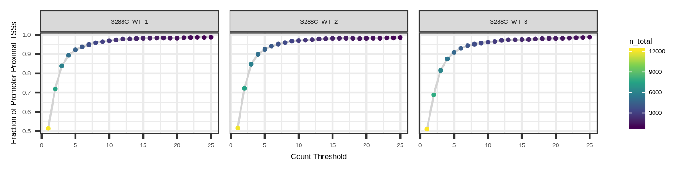
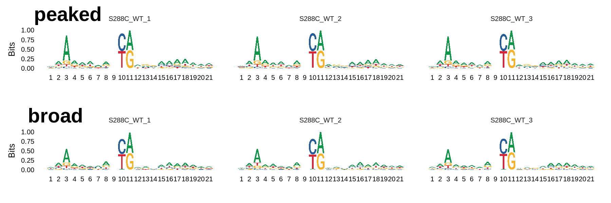
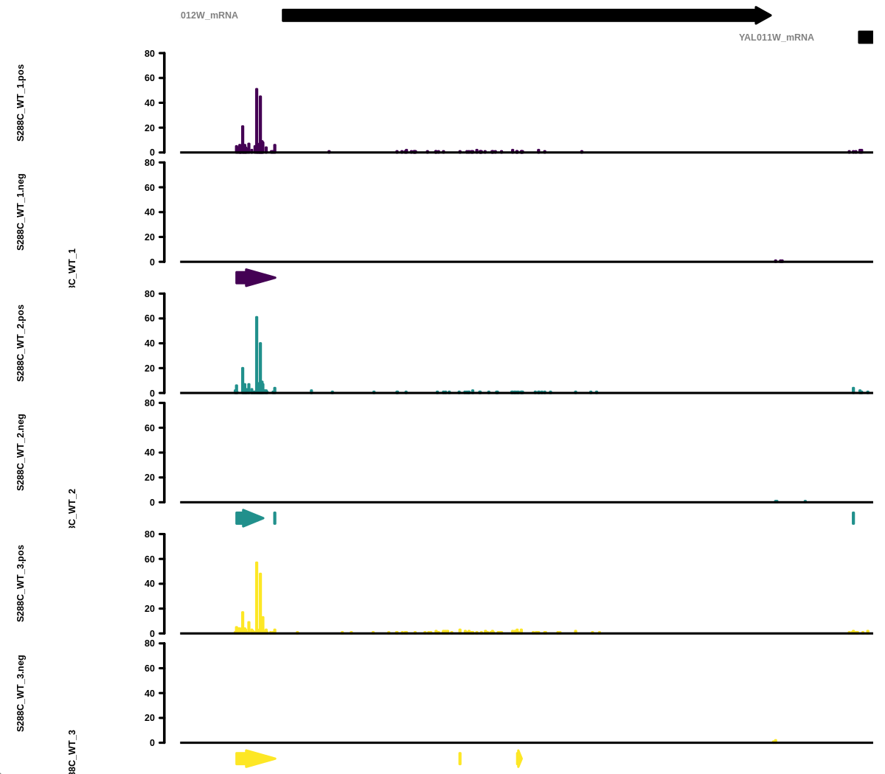

# Standard Analysis

A transcription Start Site (TSS) represents the first base position of a given transcript to be transcribed by RNA polymerase. Most genes do not have a single TSS, but rather a collection of TSS positions collectively referred to as a Transcription Start Region (TSR). Variation in TSS selection influences transcription stability and translation as the function of the encoded protein. Furthermore, variations in TSS usage have been observed during organismal development as well as in diseases such as cancer.

TSRexploreR offers a series of analysis and plotting functions that allow deep exploration of TSSs and TSRs. Here, we describe the standard TSRexploreR analysis pipeline, qq

## Preparing Data

This example uses a set of *S. cerevisiae* TSSs identified with the STRIPE-seq method.
There are many ways to import TSSs into TSRexploreR; this vignette uses a named list of GRanges as input into the function that creates the tsrexplorer object.

```
library("tsrexplorer")
library("magrittr")

TSSs <- system.file("extdata", "S288C_TSSs.RDS", package = "tsrexplorer")
TSSs <- readRDS(TSSs)

# Keep only the 3 WT samples for now.
TSSs <- names(TSSs) %>%
	stringr::str_detect("WT") %>%
	purrr::keep(TSSs, .)

exp <- tsr_explorer(TSSs)
```

## Initial TSS Processing

After the TSSs are loaded into the tsrexplorer object, a few processing steps are necessary in order to prepare the data for analysis.

### Format TSSs

The first step is to convert the TSSs into a table that will facilitate downstream analysis.

```
exp <- format_counts(exp, data_type = "tss")
```

### Normalize TSSs

The next step is to normalize TSS counts using the Counts Per Million (CPM) approach. This step is optional - if the counts you input were already normalized, this step can be safely skipped.

```
exp <- cpm_normalize(exp, data_type = "tss")
```

### TSS Annotation

After formatting counts and optionally CPM normalizing them, TSSs will be annotated relative to known features. This function takes either the path and file name of a 'GTF' or 'GFF' file, or a 'TxDb' package from bioconductor. The example below uses a 'GTF' file from Ensembl (R64-1-1 Release 99) and annotates each TSS to the closest transcript.

```
annotation <- system.file("extdata", "S288C_Annotation.gtf", package = "tsrexplorer")

exp <- annotate_features(
        exp, annotation_data = annotation,
        data_type = "tss", feature_type = "transcript"
)
```

### Naive Threshold Exploration

All TSS mapping methods contain some degree of background in the form of low-count TSSs, particularly within gene bodies. This background can complicate downstream analysis, but it can largely be removed via a simple thresholding approach, wherein TSSs below a certain number of counts are removed from further consideration. If a genome annotation is available, a thresholding plot may help in picking this read threshold. In this approach, the fraction of TSSs that are promoter-proximal is plotted against a range of read thresholds. The number of features (genes or transcripts) with at least one unique promoter-proximal TSS position at each threshold is also indicated graphically.


```
threshold_data <- explore_thresholds(exp, max_threshold = 25)

p <- plot_threshold_exploration(threshold_data, ncol = 3, point_size = 0.5) +
	ggplot2::theme(text = element_text(size = 4), legend.key.size = unit(0.3, "cm"))

ggsave("tss_thresholding.png", plot = p, device = "png", type = "cairo", height = 1.25, width = 5)
```



Looking at the plot, a threshold of three or more reads is a sensible choice: there is a precipitous drop in detected features for a comparatively low gain in promoter-proximal TSS fraction at higher thresholds.

## TSS Correlation

Assessing correlation between samples provides information on replicate similarity and can also give a cursory indication of the degree of difference between biologically distinct samples (e.g. different genotypes or treatments).

### TMM Normalization

For correlation analysis, TSRexploreR uses TMM normalization via the edgeR package.
This method was designed to make comparison **between** samples more efficacious. In the example below, TSSs are retained only if at least one sample has a count of 3 or more reads.

```
exp <- count_matrix(exp, data_type = "tss")
exp <- tmm_normalize(exp, data_type = "tss", threshold = 3, n_samples = 1)
```

### Correlation Matrix Plots

After TMM normalizing the samples, various correlation plots can be generated.
This this example, a combined scatterplot/heatmap is generated.

```
p <- plot_correlation(exp, data_type = "tss", font_size = 2, pt_size = 0.4) +
        ggplot2::theme_bw() +
        ggplot2::theme(text = element_text(size = 3), panel.grid = element_blank())

ggsave("tss_correlation.png", plot = p, device = "png", type = "cairo", height = 2, width = 2)
```


## TSS Genomic Distribution

As part of the initial TSS processing, TSSs were annotated relative to known features. This information can be used to explore the genomic distribution of TSSs and also to plot the total number of detected features and the number of detected features with a promoter-proximal TSS.
### Genomic Distribution Plot

A stacked bar plot can be generated to showcase the fractional distribution of TSSs relative to known features.

```
tss_distribution <- genomic_distribution(exp, data_type = "tss", threshold = 3)

p <- plot_genomic_distribution(tss_distribution) +
	ggplot2::theme(text = element_text(size = 4), legend.key.size = unit(0.3, "cm"))

ggsave("tss_genomic_distribution.png", plot = p, device = "png", type = "cairo", height = 1, width = 2.5)
```


### Feature Detection Plot

The number of features detected and fraction of features with a promoter-proximal TSSs can be displayed as a stacked bar plot or jitter plot.

```
features <- detect_features(exp, data_type = "tss", threshold = 3)

p <- plot_detected_features(features) +
	ggplot2::theme(text = element_text(size = 3), legend.key.size = unit(0.3, "cm"))

ggsave("tss_feature_plot.png", plot = p, device = "png", type = "cairo", height = 1, width = 1.75)
```


### Density Plots

Density plots are useful for visualizing where, on average, TSSs are located relative to annotated TSSs. The current yeast genome annotation does not contain information on 5' UTRs, so density plots are centered on annotated start codons and it is expected that the maximum density would be slightly upstream of the plot center. Most other organisms have 5' UTR information in their genome annotation, with the UTR length corresponding to the distance between the start codon and the most distal TSS detected. This would result in a density plot that is largely centered.

```
p <- plot_density(exp, data_type = "tss", threshold = 3, ncol = 3) +
	ggplot2::theme(text = element_text(size = 4))

ggsave("tss_density_plot.png", plot = p, device = "png", type = "cairo", height = 1, width = 2)
```


### Heatmaps

While a density plot gives a general overview of TSS distribution relative to annotated start codons or TSSs, information may be lost in the process due to the aggregate nature of this plot type. To get a more global view of the data, it can be useful to generate a heatmap of TSS positions relative to all features. However, as TSS are single points and are sometimes sparsely distribution, it can be somewhat difficult to visualize them as a heatmap.

```
count_matrix <- tss_heatmap_matrix(exp, threshold = 3, upstream = 250, downstream = 250)

p <- plot_heatmap(count_matrix, ncol = 3, background_color = "white") +
	ggplot2::theme(text = element_text(size = 4), legend.key.size = unit(0.3, "cm"))

ggsave("tss_heatmap.png", plot = p, device = "png", type = "cairo", height = 2, width = 4)
```


## Sequence Analysis

TSSs tend to occur within certain sequence contexts, and this context can vary between species. Knowing this TSS sequence bias can give mechanistic and biologically relevant information on promoter structure.

### TSS Sequence Logo

Generating sequence logos around TSSs is a good preliminary step to better understand the sequence context of TSSs. For example, in *S. cerevisiae* it has been reported that there is a pyrimidine-purine bias in the -1 and +1 positions, respectively. Furthermore, stronger TSSs tend to have an adenine at the -8 position, the loss of which diminishes promoter strength.

To generate analyze TSS sequence context, TSRexploreR retrieves  sequences centered on TSSs from a 'FASTA' genome assembly or 'BSgenome' object. This example uses the Ensembl R64-1-1 Release 99 FASTA.

```
assembly <- system.file("extdata", "S288C_Assembly.fasta", package = "tsrexplorer")

seqs <- tss_sequences(exp, genome_assembly = assembly, threshold = 3)
```

After the sequences are retrieved, the sequence logos can be generated.

```
p <- plot_sequence_logo(seqs, ncol = 3)

png("tss_seq_logo.png", units = "in", res = 300, height = 1, width = 6, type = "cairo")
p
dev.off()
```


### Sequence Color Map

A sequence logo "averages" the bases when displaying data, but, as with TSSs, it can be useful to view the information without aggregation. In a sequence color map, each row represents the window around a TSS and each column represents a specific position relative to this TSS. These display conventions analogous to those used in a heatmap. Each base is assigned a color and displayed in this context. The prevalence of colors in certain positions can give further evidence towards putative sequence contexts. The same genome assembly and retrieved sequences that were used to make the sequence logos above are used here.

```
p <- plot_sequence_colormap(seqs, ncol = 3) +
	ggplot2::theme(text = element_text(size = 4), legend.key.size = unit(0.3, "cm"))

ggsave("tss_seq_colormap.png", plot = p, device = "png", type = "cairo", height = 1.5, width = 3)
```


### Dinucleotide Frequency

As previously discused, organisms often have a specific TSS sequence context. This function explores the fraction of each potential dinucleotide at the -1/+1 positions of all TSSs, where the +1 position is the TSS.

```
assembly <- system.file("extdata", "S288C_Assembly.fasta", package = "tsrexplorer")

frequencies <- dinucleotide_frequencies(exp, genome_assembly = assembly, threshold = 3)

p <- plot_dinucleotide_frequencies(frequencies, ncol = 3) +
	ggplot2::theme(text = element_text(size = 6))

ggsave("tss_dinucleotide_frequencies.png", plot = p, device = "png", type = "cairo", height = 2, width = 5)
```


## Clustering TSSs

Initiation is rarely homogenous. It is generally the case that a gene will have multiple TSSs clustered into a TSR, and so analyzing TSRs versus individual TSSs will provide more realistic information on initiation. Moreover, TSR shape features have been shown to correlate with distinct gene classes.

### Distance Clustering

To identify TSRs, TSRexploreR uses a distance clustering method. This approach groups TSSs that pass a certain read threshold and are within a certain distance from one another into TSRs. However, if you have called TSRs using other methods (e.g. Paraclu or RECLU), they can be imported directly.

```
exp <- tss_clustering(exp, threshold = 3, max_distance = 25)
```

### Associating TSSs with TSRs

TSSexploreR provides great flexibility for working with TSSs and TSRs. After TSRs are called or imported, TSSs can be assigned to TSRs they overlap with. In this example, TSSs are associated with the TSRs detected above using distance clustering. However, this function could also be used to associate TSSs with TSRs called elsewhere or a merged/consensus TSR set.

```
exp <- associate_with_tsr(
	exp, use_sample_sheet = FALSE,
	sample_list = list(
		"S288C_WT_1" = "S288C_WT_1",
		"S288C_WT_2" = "S288C_WT_2",
		"S288C_WT_3" = "S288C_WT_3"
	)
)
```

## Initial TSR Processing

Now that the TSSs have been clustered and associated with TSRs, the TSRs can undergo initial processing. This involves annotating the TSRs, calculating various metrics of TSR shape and strength, and optional normalization of the TSR scores.

### TSR Metrics

After TSSs have been associated with TSRs, various metrics describing TSR shape and strength can be computed. First, the dominant TSS (that is, the highest-scoring TSS) within a TSR will be annotated. Then, various shape features such as inter-quantile range, shape index, and balance will be calculated.

```
exp <- mark_dominant(exp, data_type = "tss", threshold = 3)
exp <- tsr_metrics(exp)
```

### Normalize TSRs

The TSRs can optionally be CPM normalized.

```
exp <- cpm_normalize(exp, data_type = "tsr")
```

### Annotate TSRs

It is recommended to annotate the TSRs if a genome annotation is available.

```
annotation <- system.file("extdata", "S288C_Annotation.gtf", package = "tsrexplorer")

exp <- annotate_features(
        exp, annotation_data = annotation,
        data_type = "tsr", feature_type = "transcript"
)
```

## TSR Correlation

Smiilar to looking at the correlation of TSSs, looking at TSR correlation before further analysis is good practice.

### TMM Normalization

TMM normalization is also used for comparing TSRs.

```
exp <- count_matrix(exp, data_type = "tsr")
exp <- tmm_normalize(exp, data_type = "tsr")
```

### Correlation Matrix Plots

After TMM normalization, correlation plots can be generated.

```
p <- plot_correlation(exp, data_type = "tsr", font_size = 2, pt_size = 0.4) +
        ggplot2::theme_bw() +
        ggplot2::theme(text = element_text(size = 3), panel.grid = element_blank())

ggsave("tsr_correlation.png", plot = p, device = "png", type = "cairo", height = 2, width = 2)
```


## TSR Genomic Distribution

As for TSSs, it is expected that TSRs will be be enriched upstream of annotated start codons.

### Genomic Distribution Plot

A stacked bar plot can be generated to visualize the fractional distribution of TSRs relative to known features.

```
tsr_distribution <- genomic_distribution(exp, data_type = "tsr", threshold = 3)

p <- plot_genomic_distribution(tsr_distribution) +
        ggplot2::theme(text = element_text(size = 4), legend.key.size = unit(0.3, "cm"))

ggsave("tsr_genomic_distribution.png", plot = p, device = "png", type = "cairo", height = 1, width = 2.5)
```


### Feature Detection Plot

The number of features detected and fraction of features with a promoter-proximal TSSs can be displayed as a stacked bar plot or jitter plot.

```
features <- detect_features(exp, data_type = "tsr")

p <- plot_detected_features(features) +
        ggplot2::theme(text = element_text(size = 3), legend.key.size = unit(0.3, "cm"))

ggsave("tsr_feature_plot.png", plot = p, device = "png", type = "cairo", height = 1, width = 1.75)
```


### Density Plots

As for TSSs, density plots can be generated for TSRs.

```
p <- plot_density(exp, data_type = "tsr", ncol = 3) +
        ggplot2::theme(text = element_text(size = 4))

ggsave("tsr_average_plot.png", plot = p, device = "png", type = "cairo", height = 1, width = 2)
```


### Heatmaps

TSR heatmaps provide a global view of TSR distribution relative to annotate start codons or TSSs.

```
count_matrix <- tsr_heatmap_matrix(exp, threshold = 3, upstream = 500, downstream = 500)

p <- plot_heatmap(count_matrix, ncol = 3, background_color = "white") +
        ggplot2::theme(text = element_text(size = 4), legend.key.size = unit(0.3, "cm"))

ggsave("tsr_heatmap.png", plot = p, device = "png", type = "cairo", height = 2, width = 4)
```


## TSR Metrics and Shape

After clustering the TSSs into TSRs, various descriptive and quantative measures were calculated. These are: TSR width, log2 + 1 TSR score, shape index, inter-quantile width, peak balance, and peak concentration.

### Summary Plots

Summary plots can be generated for most TSR metrics. In this example, we generate violin plots of the log2 + 1 transformed TSR score and TSR width.

```
p <- plot_tsr_metric(exp, tsr_metrics = c("score", "width"), log2_transform = TRUE, ncol = 2) +
	ggplot2::theme(text = element_text(size = 5), legend.key.size = unit(0.3, "cm"))

ggsave("tsr_metrics.png", plot = p, device = "png", type = "cairo", height = 1, width = 3)
```


### Descriptive Plots

Most plots in this vignette can be filtered, ordered, grouped, and quantiled
by any of the desired metrics. Here is an example of what can be done with the TSS sequence motif plot using TSR metrics. In this plot, only the dominant TSSs of each TSR is considered, and TSSs with a score below 10 are discarded. The plot is then split by the shape class of the TSR. A more detailed guide to advanced plotting can be found here.

```
assembly <- system.file("extdata", "S288C_Assembly.fasta", package = "tsrexplorer")

conditions <- list(order_by = "score", grouping = "shape_class")
seqs <- tss_sequences(
	exp, genome_assembly = assembly, threshold = 10,
	dominant = TRUE, data_conditions = conditions
)

p <- plot_sequence_logo(seqs, ncol = 3)

png("tss_seq_logo_conditioned.png", units = "in", res = 300, height = 2, width = 6, type = "cairo")
p
dev.off()
```



## Gene Tracks

Vieweing TSSs and/or TSRs in gene tracks can be useful for a variety of reasons. It can make clear which 5' isoforms of a transcript are expressed, hint at potential misannotation of genes, uncover 5' UTR structure, and various other goodies. In TSRexploreR, tracks can be created based on a gene/transcript name or genomic coordinates.
Additionally, if tracks are generated based on genes/transcripts, the promoter region alone can optionally be displayed.

```
annotation <- system.file("extdata", "S288C_Annotation.gtf", package = "tsrexplorer")

png("gene_track.png", units = "in", res = 300, height = 3.5, width = 4, type = "cairo")
gene_tracks(
	exp, annotation, feature_name = "YAL012W",
	samples = c(
		"TSS:S288C_WT_1", "TSR:S288C_WT_1",
		"TSS:S288C_WT_2", "TSR:S288C_WT_2",
		"TSS:S288C_WT_3", "TSR:S288C_WT_3"
	),
	ymax = 80, tss_colors = viridis::viridis(3), tsr_colors = viridis::viridis(3)
)
dev.off()
```



